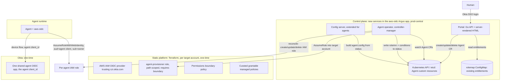

# Agent Registry Control Plane in aws-oidc

## What we are building

This plan adds an agent-registry control plane to the existing `aws-oidc` Argus app in prod-central. It is a new portal service (a Go API that also serves a minimal server-rendered HTML UI) and a Kubernetes operator, both shipped in the `aws-oidc` repo and image alongside the existing config server and the rolemap cronjob. A human authenticates with Okta, registers an agent, and grants it scoped AWS access from a curated catalog. The portal writes an `Agent` custom resource. An operator watches `Agent` CRs and reconciles the desired grants into per-agent IAM roles across the target accounts, each bounded by a permissions boundary with a trust policy that only the shared agent Okta client can use. The CR is the source of truth. There is no separate database.

Living in `aws-oidc` lets us reuse what is already there: the `rolemap` ConfigMap and `pkg/configmap` for entitlements, `pkg/aws_config_server` for the config the agent's `aws-oidc configure` pulls, and the same image, service account, and RBAC patterns. The config server is extended to produce the agent-specific config from Agent CR status.

The portal is not an access-request tool. It only surfaces the AWS accounts the human can already access and, per account, a dropdown of registry policies. An agent can therefore receive only a subset of its owner's existing access, never new access.

No Vault. AWS STS web-identity federation is the broker. `aws-oidc` remains the unchanged client on the agent side.

## Architecture



## Operator and CRD model

A single `Agent` custom resource represents an agent and all its grants. The CR is the source of truth. There is no database. The portal writes CRs, the operator reconciles them into AWS. All Agent CRs live in the same namespace Argus deploys the app to, so the operator and portal use namespaced RBAC (a `Role`, not a `ClusterRole`) in that one namespace.

Reconcile loop, per `Agent` CR:

- For each grant in `spec.grants`, assume the per-account `agent-provisioner` role and ensure an IAM role exists under `/agents/` with the permissions boundary attached, the trust policy conditioned on the agent client id and the owner, and the catalog policy for that grant.
- Write each provisioned role ARN and a per-grant condition to `status`.
- A finalizer deletes the target-account roles when the CR is deleted, so deregistration cleans up AWS.
- On resync the operator corrects drift, recreating or repairing a role that was changed or removed out of band.
- The operator runs a single active replica with leader election, and uses a rate-limited workqueue so failed reconciles requeue with exponential backoff rather than hot-looping against the AWS APIs.

Multi-account: the operator's ServiceAccount uses IRSA as the control-plane identity and assumes the per-account provisioner role for whichever account a grant targets.

Enforcement on writes: users go through the portal, which stamps the owner from the authenticated Okta identity. A validating admission webhook stamps or verifies the owner and rejects grants outside the catalog or beyond the boundary, so a direct `kubectl apply` cannot forge ownership or widen scope.

## Access model: agents get a subset of the owner's access

The portal is not an access-request tool. It never grants access to an account the human cannot already reach, and it never grants an agent more than the human already has.

- Accounts shown come from the caller's existing entitlements, read from the same `rolemap` ConfigMap the config server already uses (`pkg/configmap.ReadRoleMappings`). The portal lists only accounts where the human can assume a role.
- Per account, the human picks from a dropdown of registry (catalog) policies. There is no free-form policy and no account entry box.
- Owner ceiling: an agent grant must be within the human's own access in that account. The operator sets the agent role's permissions boundary so the agent can never exceed that ceiling, and the admission webhook rejects any grant whose account is not in the caller's entitlements or whose catalog policy exceeds the caller's access.

The catalog and the owner-ceiling mapping are config-driven, edited via a config file or ConfigMap in the style of the existing rolemap, so they can change often without a rebuild. The exact schema is still open (for example tagging each catalog policy with the access tier it requires and offering only those the caller's role covers, or deriving the agent role's permissions boundary from the caller's effective access). Either way the invariant holds: agent access is a subset of owner access.

## Authorization: own agents vs admin

The portal authorizes every request from the caller's verified Okta ID token.

- Regular users see and edit only their own agents. The portal lists `Agent` CRs where `spec.owner` equals the caller's Okta subject, and permits create, edit, and delete only on those.
- Admins see and edit all agents. An admin is a caller whose ID token carries one of the admin groups listed in the portal's config file (a set of `team-*` groups). The set is config, not code, so it changes without a rebuild. The portal exposes an admin view that lists and edits every `Agent` CR regardless of owner, preserving each CR's original `spec.owner` on edit rather than reassigning it.
- The portal is the authorization gate for human actions, since users have no direct Kubernetes access and act only through it. The admission webhook is the backstop against any principal with direct cluster access, verifying `spec.owner` and rejecting forged ownership or out-of-scope grants.

## Provisioning model and isolation

Per-agent IAM role trust policy conditions on both:

- `czi.okta.com:aud` equals the shared agent client id. Poweruser roles trust the human client id, so an agent token has the wrong audience and cannot assume them.
- `czi.okta.com:sub` equals the owner. One human cannot assume another human's agent role.

The role gets the owner-selected catalog policy plus the permissions boundary, always. Free-form policy JSON is not allowed.

## Client-side enforcement (Claude Code enterprise managed settings)

The portal is the server-side half. The client-side half is Claude Code enterprise managed settings that steer the agent onto its own scoped config and away from the human's credentials. This is the counterpart to the server-side trust conditions.

This iteration favors steering over hard enforcement. Getting everyone onto the sandbox will be hard because many workflows break, so we do not gate on it on day one. The sandbox starts disabled (`enabled` is false to begin with). Even once it is turned on it stays best-effort (`failIfUnavailable` and `allowUnsandboxedCommands` relaxed). We lean on the environment overwrite, the read denies, prompts, and a steering hook to guide the agent. Adoption is tracked through audit trails so we can see how well it is working before considering any hardening.

In this design the agent uses its own `AWS_CONFIG_FILE`, whose `credential_process` runs `aws-oidc` with the shared agent client id to mint its own scoped credentials. Per-agent scoping is enforced by the role trust conditions. The sandbox is used only if the user enables it, and when enabled it must permit Okta and STS egress for that mint. Credential isolation comes from three things working together:

1. Overwrite the AWS environment so the agent resolves only its own config, never the human's profiles.
2. Deny reads of the human's AWS config and credentials (`~/.aws`).
3. Keep the human token cache in Keychain (a mach service the sandbox does not broker) while the agent uses a file-based cache in an allowed directory. This requires the file-based cache flag on `aws-oidc` for the agent.

Ship this as a checked-in template in the `aws-oidc` repo, for example `enterprise/claude-code/managed-settings.json`, distributed by MDM to the OS managed path. Managed scope cannot be overridden by user or project settings.

```json
{
  "requiredMinimumVersion": "2.1.187",
  "env": {
    "AWS_CONFIG_FILE": "/opt/agent-aws/config",
    "AWS_SHARED_CREDENTIALS_FILE": "/opt/agent-aws/credentials",
    "AWS_PROFILE": "agent-scoped"
  },
  "permissions": {
    "deny": [
      "Read(~/.aws/**)"
    ]
  },
  "sandbox": {
    "_comment": "SOFT LAUNCH. TODO: enforce once we get most user/agent workflows worked out. Then set enabled=true, failIfUnavailable=true, allowUnsandboxedCommands=false.",
    "enabled": false,
    "failIfUnavailable": false,
    "allowUnsandboxedCommands": true,
    "filesystem": {
      "denyRead": ["~/.aws"],
      "allowWrite": ["/opt/agent-aws/cache", "/tmp/build"]
    },
    "credentials": {
      "files": [
        { "path": "~/.aws/config", "mode": "deny" },
        { "path": "~/.aws/credentials", "mode": "deny" }
      ],
      "envVars": ["AWS_ACCESS_KEY_ID", "AWS_SECRET_ACCESS_KEY", "AWS_SESSION_TOKEN"]
    },
    "network": {
      "_comment": "SOFT LAUNCH. TODO: enforce egress once adoption is high. Then set allowManagedDomainsOnly=true and add a real allowlist or denylist.",
      "allowManagedDomainsOnly": false,
      "allowedDomains": [
        "api.anthropic.com",
        "czi.okta.com",
        "*.okta.com",
        "sts.amazonaws.com",
        "*.sts.amazonaws.com"
      ]
    }
  },
  "hooks": {
    "PreToolUse": [
      {
        "matcher": "Bash",
        "hooks": [
          {
            "type": "command",
            "command": "bash \"/Library/Application Support/ClaudeCode/hooks/steer-aws-creds.sh\""
          }
        ]
      }
    ]
  }
}
```

The steering hook, shipped alongside the settings (for example `enterprise/claude-code/hooks/steer-aws-creds.sh`), detects a Bash command that targets a human profile or reads the human credential files and asks rather than blocks:

```bash
#!/usr/bin/env bash
set -euo pipefail

input=$(cat)
command=$(printf '%s' "$input" | jq -r '.tool_input.command // empty')

# Nudge when the command points at a human profile or reads the human AWS config.
if printf '%s' "$command" | grep -Eq -- '--profile[= ]|AWS_PROFILE=|~?/\.aws/|\$HOME/\.aws/'; then
  if ! printf '%s' "$command" | grep -Eq -- '--profile[= ]?agent-scoped|AWS_PROFILE=agent-scoped'; then
    jq -n '{
      hookSpecificOutput: {
        hookEventName: "PreToolUse",
        permissionDecision: "ask",
        permissionDecisionReason: "This looks like it uses a human AWS profile or reads ~/.aws. Prefer the agent-scoped profile (AWS_PROFILE=agent-scoped), which is already the default. Only continue if you truly need the human profile."
      }
    }'
    exit 0
  fi
fi

exit 0
```

Notes on the choices:

- Env overwrite is the primary lever. `env` points `AWS_CONFIG_FILE`, `AWS_SHARED_CREDENTIALS_FILE`, and `AWS_PROFILE` at the agent config so all AWS calls resolve it, not `~/.aws`, and it works even with the sandbox off. `credentials.envVars` strips static AWS keys so the agent cannot inherit ambient ones (`AWS_PROFILE` is kept, since `env` sets it).
- Read denies use two non-overlapping layers, both needed: `permissions.deny` covers Claude's Read tool, and sandbox `denyRead` / `credentials.files` cover Bash subprocesses (only once the sandbox is enabled).
- Soft launch: the sandbox starts `enabled: false` (its denies inert), and when later enabled `failIfUnavailable: false` and `allowUnsandboxedCommands: true` keep it non-breaking. `_comment` keys carry the enforce-later TODOs, since Claude Code rejects real JSON comments.
- Token cache: the human stays on Keychain (the sandbox cannot broker it); the agent uses a file cache under `/opt/agent-aws/cache` (an `allowWrite` path). On Linux also `denyRead` the on-disk human cache.
- No egress control this iteration. `allowedDomains` only pre-clears what the agent needs (Anthropic, Okta, STS) and `allowManagedDomainsOnly` stays `false`, so nothing else is blocked. Isolation comes from the env overwrite, the read denies, and the trust conditions, not the network layer. Real egress restriction and SSH/GitHub denies are deferred.
- Steering, not blocking. The `PreToolUse` hook asks (not denies) when a human profile or `~/.aws` is referenced, and `aws` stays available.

Roll out soft. Start with the sandbox disabled (`enabled` false) and rely on the environment overwrite, the Read denies, prompts, and the steering hook to guide the agent. Track adoption through audit trails. Turn the sandbox on best-effort next (`enabled` true with `failIfUnavailable` false and `allowUnsandboxedCommands` true) once the common breakages are understood. Consider hardening last (set `failIfUnavailable` true, `allowUnsandboxedCommands` false, and add `allowManagedDomainsOnly`) only once adoption is high. Verify that `aws sts get-caller-identity` resolves the agent role by default.

## Repo structure changes

Add to the existing `aws-oidc` repo and image (module `github.com/chanzuckerberg/aws-oidc`). The new workloads are cobra subcommands of the same binary, matching how `serve-config` and `update-rolemap` already work:

- `api/v1/` the `Agent` CRD Go types plus generated deepcopy.
- `cmd/operator.go` the controller-manager subcommand (`aws-oidc operator`).
- `cmd/serve-portal.go` the portal API subcommand (`aws-oidc serve-portal`).
- `internal/controller/` the Agent reconciler.
- `internal/provisioner/` STS assume into target accounts and IAM role create/update/delete with the boundary, used by the controller.
- `internal/catalog/` the curated grantable policies.
- `internal/portal/` Okta login/session, the minimal server-rendered HTML UI (Go `html/template`), Agent CR CRUD via the Kubernetes API, and the entitlements and catalog endpoints.
- `internal/webhook/` the validating/mutating admission webhook.
- `config/crd/` the Agent CRD manifest; RBAC added to the existing `.infra/*/templates/rbac.yaml`.
- The per-account bootstrap (OIDC provider, provisioner role, boundary, catalog) lives in shared-infra's all-accounts Terraform, not this repo. Any repo-local Terraform is limited to the one-time Okta agent app.

Reuse what `aws-oidc` already has: `pkg/configmap` (read the `rolemap` for entitlements), `pkg/okta` (rolemap types), and `pkg/aws_config_server` (extended to serve agent configs). No new module or image.

## Extending the config server for agents

The agent config is produced by the existing config server in [pkg/aws_config_server/webserver.go](../pkg/aws_config_server/webserver.go), not a new mirror. Today it serves human profiles from the `rolemap` ConfigMap. Extend it with an agent path that builds `AWSConfig` from the caller's Agent CR `status.grants`, reusing the existing `AWSProfile` shape in [pkg/aws_config_server/types.go](../pkg/aws_config_server/types.go) and the `creds-process` line format in [pkg/aws_config_client/completer.go](../pkg/aws_config_client/completer.go), with the shared agent client id and the per-agent role ARN. The `aws-oidc configure` client is unchanged; it just points `--config-url` at the agent path.

### Example: what `aws-oidc configure` produces for an agent

Run once to populate the agent config:

```bash
AWS_CONFIG_FILE=/opt/agent-aws/config aws-oidc configure \
  --config-url=https://aws-oidc.prod-central.prod.czi.team/agent-config \
  --issuer-url=https://czi.okta.com \
  --client-id=0oaAGENTclient0123 \
  --default-region=us-west-2
```

`configure` authenticates the human, and the config endpoint returns the profiles for the agents that human owns, built from each Agent CR's `status.grants`. The `AWSConfig` JSON it returns (for an agent with grants in two accounts):

```json
{
  "profiles": [
    {
      "client_id": "0oaAGENTclient0123",
      "aws_account": { "id": "533267185808", "name": "prod-central-o11y", "alias": "prod-central-o11y" },
      "role_arn": "arn:aws:iam::533267185808:role/agents/data-bot-s3-readonly",
      "issuer_url": "https://czi.okta.com",
      "role_name": "agents/data-bot-s3-readonly"
    },
    {
      "client_id": "0oaAGENTclient0123",
      "aws_account": { "id": "359855083898", "name": "es-research", "alias": "es-research" },
      "role_arn": "arn:aws:iam::359855083898:role/agents/data-bot-athena",
      "issuer_url": "https://czi.okta.com",
      "role_name": "agents/data-bot-athena"
    }
  ]
}
```

Rendered `/opt/agent-aws/config`:

```ini
[profile agent-scoped]
output             = json
credential_process = aws-oidc creds-process --issuer-url=https://czi.okta.com --client-id=0oaAGENTclient0123 --aws-role-arn=arn:aws:iam::533267185808:role/agents/data-bot-s3-readonly --token-cache-dir=/opt/agent-aws/cache
region             = us-west-2

[profile data-bot-es-research-athena]
output             = json
credential_process = aws-oidc creds-process --issuer-url=https://czi.okta.com --client-id=0oaAGENTclient0123 --aws-role-arn=arn:aws:iam::359855083898:role/agents/data-bot-athena --token-cache-dir=/opt/agent-aws/cache
region             = us-west-2
```

Differences from the human config, and the small aws-oidc changes they imply:

- Every agent profile carries the same shared `--client-id`. This is what makes the role trust conditions (`aud` equals the agent client id) scope these profiles to agents.
- Role ARNs live under `/agents/`. These are the per-agent, boundary-bounded roles the portal created, not the human's poweruser roles.
- `--token-cache-dir=/opt/agent-aws/cache` is new. It is the file-based cache flag added in the aws-oidc update so the agent's token cache lands in an `allowWrite` path rather than the human's Keychain. This flag does not exist today.
- The default profile is `agent-scoped`, matching `AWS_PROFILE=agent-scoped` from the managed settings, so plain `aws ...` uses it with no flag. Additional grants get descriptive per-account names, which is a portal naming choice.
- Written to `AWS_CONFIG_FILE=/opt/agent-aws/config`. Honoring that env var (or adding an `--output-path` flag) is a needed change, since `configure` hardcodes `~/.aws/config` in [cmd/configure.go](../cmd/configure.go).

## Agent custom resource

The `Agent` CR is the source of truth. Example:

```yaml
apiVersion: agents.czi.team/v1
kind: Agent
metadata:
  name: data-bot
  namespace: argus-aws-oidc-prod   # the namespace Argus deploys the aws-oidc app to
spec:
  displayName: data-bot
  owner: 00uOWNERsub123        # Okta subject, stamped by the portal/webhook
  grants:
    - accountId: "533267185808"
      catalogPolicyId: s3-readonly
      region: us-west-2
    - accountId: "359855083898"
      catalogPolicyId: athena-query
      region: us-east-1
status:
  conditions:
    - type: Ready
      status: "True"
  grants:
    - accountId: "533267185808"
      roleArn: arn:aws:iam::533267185808:role/agents/data-bot-s3-readonly
      state: Provisioned
    - accountId: "359855083898"
      roleArn: arn:aws:iam::359855083898:role/agents/data-bot-athena
      state: Provisioned
  observedGeneration: 3
```

`spec.grants` is the desired state a human sets through the portal. `status.grants` is what the operator provisioned, including the role ARN the aws-oidc config endpoint reads.

## API surface

- Okta OIDC login, session cookie. The verified subject becomes the CR `spec.owner` and must equal the `sub` that `aws-oidc` later presents (validate this end to end early).
- `GET /accounts` lists the accounts the caller can access, from their Okta entitlements. This is the only account source; there is no free-form account entry.
- `GET /catalog?account={id}` lists the registry policies available for that account, filtered to the caller's access.
- `POST /agents`, `GET /agents` create and list the caller's own `Agent` CRs (filtered to `spec.owner` equals the caller) through the Kubernetes API.
- `PUT /agents/{name}/grants` set the grants (account plus catalog policy) on the CR. The server validates each account is in the caller's entitlements and each policy is within the caller's access before the operator reconciles.
- `DELETE /agents/{name}` delete the CR, whose finalizer removes the target-account roles.
- Admin routes, gated by an admin `team-*` claim, list and edit all agents regardless of owner, preserving each CR's `spec.owner`.
- `GET /agent-config` on the extended config server returns the caller's agent profiles as `AWSConfig` JSON, built from `status.grants` role ARNs. This is what `aws-oidc configure --config-url` points at.

## Static platform (Terraform, not per-agent)

The per-agent objects are dynamic, but the per-account scaffolding is static and is applied out of band by the shared-infra Terraform that already runs against every AWS account. This is cross-repo work tracked as its own item (the tf-bootstrap work item), and it must land and apply before the operator can reconcile into an account. Per account it provides:

- AWS IAM OIDC provider trusting the Okta issuer (`czi.okta.com`).
- A permissions boundary policy that is the hard ceiling for every agent role.
- An `agent-provisioner` role assumable only by the portal control-plane role. Its policy allows IAM role CRUD only under path `/agents/*` and only when `iam:PermissionsBoundary` equals the boundary ARN. It cannot edit the boundary or itself.
- The curated grantable managed policies (the catalog).

One-time in Okta: a single shared agent OIDC app. Per-agent identity comes from trust conditions, not a new app per agent.

## Deployment (Argus)

Extend the existing `aws-oidc` Argus app (prod-central, account 533267185808) rather than creating a new app. Add to `.infra/common.yaml` and `.infra/prod/values.yaml`, next to the existing `aws-oidc` config server service and the `rolemap-updater` cronjob:

- A `portal` service (Go API plus server-rendered HTML) with an ingress rule.
- An `operator` service running the controller-manager (`args: [operator]`) as its own Deployment, a single active replica with leader election. Same image, different args, matching how `rolemap-updater` reuses the image.
- The `Agent` CRD, and RBAC in `.infra/*/templates/rbac.yaml`: the operator reconciles Agents and writes status; the portal CRUDs Agents and reads the `rolemap` ConfigMap (the config server already has that read grant).
- IRSA for the operator (assume the per-account provisioner roles) and the portal service account.
- The Okta client secret via the Argus stack secret, as the config server already consumes Okta config. No database.
- Serve `GET /agent-config` from the existing config server service, which already reads the cluster and Okta, rather than standing up a separate endpoint.

Keep the config server, portal, and operator as three separate subcommands and services so each rolls independently. The config server and portal are request-serving and get restarted and scaled routinely; isolating the operator in its own Deployment means that churn never interrupts its reconcile loop.

## Security-critical callouts

- Permissions boundary is mandatory on every agent role. Without it the operator is an escalation machine.
- The `agent-provisioner` role must be constrained by `iam:PermissionsBoundary`, path `/agents/*`, and must not be able to alter the boundary or itself.
- The admission webhook is the write-time gate and ships in v1. It stamps the owner and enforces catalog-only, boundary-bounded grants, so direct kubectl writes cannot forge ownership or widen scope.
- Scope the operator and portal Kubernetes RBAC tightly. The portal should only CRUD Agent CRs; only the operator should write status and hold the IRSA identity that assumes provisioner roles.
- Owner ceiling is enforced, not optional. The portal only shows accounts the owner can already access and catalog policies within the owner's access, and the webhook plus permissions boundary guarantee an agent never exceeds its owner. Getting new account access still goes through the existing Okta OIG flow, not this portal.
- Catalog only, no free-form policies, no free-form account entry.

## Open items to confirm during build

- The exact schema for the catalog and owner-ceiling mapping. It must be config-driven and easy to edit often, via a config file or ConfigMap in the style of the existing rolemap, not code. The shape is still to be decided (for example per-policy access tiers vs a boundary derived from the caller's effective access).

## Delivery (stacked PRs, all in aws-oidc)

Ordered so each PR is inert or additive on its own, per the stacked-PR convention. The shared-infra all-accounts bootstrap (tf-bootstrap) is a cross-repo prerequisite. It must merge and apply before the operator can reconcile into a target account, so pin to it and land it first.

## Work items

- [ ] Define the `Agent` CRD in `api/v1` (spec and status), generate CRD manifests and deepcopy.
- [ ] Cross-repo prerequisite: shared-infra all-accounts Terraform bootstrap (OIDC provider, permissions boundary, `agent-provisioner` role trusting the operator's control-plane role, catalog managed policies) plus the one-time Okta agent app. Must land and apply first.
- [ ] `internal/provisioner`: STS assume the per-account provisioner role and create/update/delete per-agent IAM roles under `/agents/` with the boundary and trust conditions.
- [ ] Agent controller behind `aws-oidc operator` (`cmd/operator.go`): reconcile, write status, finalizer for deletion, drift correction, leader election, and a rate-limited workqueue with backoff.
- [ ] `internal/catalog`: curated grantable policies loaded from an editable config source (config file or ConfigMap), plus validation against the boundary and owner access. Exact format TBD.
- [ ] Entitlements from the `rolemap` ConfigMap (reuse `pkg/configmap.ReadRoleMappings` and `pkg/okta`).
- [ ] Validating/mutating admission webhook: stamp owner, reject inaccessible accounts and out-of-catalog or over-scope grants.
- [ ] Portal Okta login/session and authorization (own agents vs config-file admin list).
- [ ] Portal API behind `aws-oidc serve-portal` (`cmd/serve-portal.go`): Agent CR CRUD, accounts, and catalog endpoints.
- [ ] Extend `pkg/aws_config_server` with a `/agent-config` path built from Agent CR `status.grants`.
- [ ] Minimal server-rendered HTML UI (Go `html/template`) in the portal, no SPA or frontend build: register agent, pick accessible account and catalog policy, list own agents, admin view.
- [ ] `config/crd` and namespaced RBAC in `.infra/*/templates/rbac.yaml` for the operator and portal, plus IRSA.
- [ ] Deploy: add `portal` and `operator` services to the aws-oidc Argus app (same image, `serve-portal` and `operator` args).
- [ ] `enterprise/claude-code/managed-settings.json` (soft-launch client-side enforcement).
- [ ] `enterprise/claude-code/hooks/steer-aws-creds.sh` (PreToolUse steering hook).
