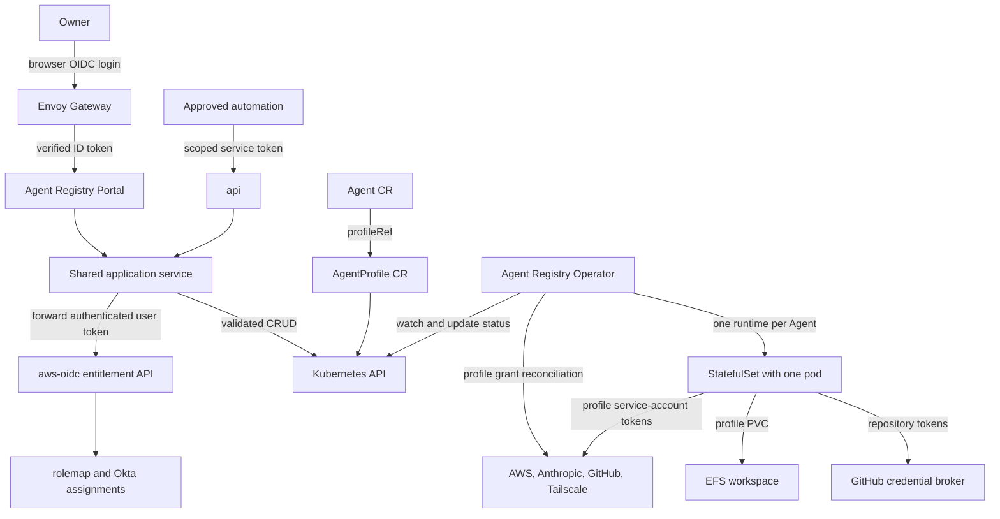

# Remote Agent Registry and Runtime Control Plane

## Goal

Build a secure paved road for remote developer agents. A person registers an
agent profile, grants it a subset of access they already hold, and starts one
or more managed Kubernetes runtimes that use the profile's machine identity.
The platform provides durable storage, centrally managed defaults, private
connectivity, provider integrations, and an API that supports both the portal
and automation.

The production system will live in a new
`chanzuckerberg/agent-registry` repository and a new `agent-registry` Argus
application at `agents.czi.team`. It will not be built or deployed from the
`aws-oidc` repository. The only production dependency on `aws-oidc` is a
versioned service API that returns the authenticated user's AWS entitlements.

Kubernetes custom resources are the durable source of truth:

- `AgentProfile` describes ownership, grants, provider identities, durable
  state, managed configuration, and runtime defaults.
- `Agent` describes one concrete pod instantiation of an `AgentProfile`.

The public API is the control-plane boundary. The portal and approved
automation use it instead of receiving Kubernetes credentials or writing
custom resources directly.

## Scope

The first production iteration includes:

- a versioned JSON API and generated server/client bindings
- a small server-rendered portal over the same application service
- `AgentProfile` and `Agent` custom resource definitions (CRDs)
- an operator that reconciles profiles, grants, and runtime pods
- AWS entitlements obtained from `aws-oidc`
- AWS, Anthropic, GitHub, and Tailscale integrations
- one default persistent interactive `Agent` per profile
- support in the resource and API model for additional instances
- EFS-backed profile state mounted at `/workspace`
- suspend and resume without losing profile state
- centrally managed runtime defaults, Claude settings, hooks, and telemetry

The following are not part of this implementation:

- the integration router for Slack messages, GitHub webhooks, or other
  automated event sources
- migration or cleanup of POC resources
- laptop agent profiles or extensions to `aws-oidc configure`
- a user-facing CLI application
- blocking local agents
- defining organization-wide security policy

There is no intention to build a CLI in this pass. The API remains suitable
for future programmatic clients, but CLI commands, device authorization,
credential storage, packaging, and distribution are deferred until there is a
concrete need.

The integration router can be designed separately. It will eventually use the
public API to instantiate bounded or time-limited `Agent` resources that refer
to existing profiles. It must not write CRs directly.

## POC findings

[aws-oidc#1264](https://github.com/chanzuckerberg/aws-oidc/pull/1264)
is an implementation reference, not production code to merge into
`aws-oidc`. The POC demonstrated that the platform can:

- isolate remote agents with Kubernetes primitives
- assign human ownership to a machine identity
- use projected Kubernetes service-account tokens with AWS, Anthropic, and
  Tailscale
- use a GitHub App when a provider does not support workload identity
  federation
- persist repositories, sessions, memories, and configuration on EFS
- connect humans through Tailscale SSH
- apply managed settings, hooks, prompts, and runtime defaults

The POC's Agent CRs, pods, persistent volumes, IAM roles, provider
registrations, and local Terraform state are outside this plan. They do not
need migration, compatibility, adoption, deletion, or cleanup as part of the
new implementation.

## Architecture


```mermaid
flowchart TB
  owner["Owner"] -->|"browser OIDC login"| gateway["Envoy Gateway"]
  gateway -->|"verified ID token"| portal["Agent Registry Portal"]
  automation["Approved automation"] -->|"scoped service token"| api
  portal --> app["Shared application service"]
  api --> app

  app -->|"forward authenticated user token"| entitlements["aws-oidc entitlement API"]
  entitlements --> rolemap["rolemap and Okta assignments"]
  app -->|"validated CRUD"| kube["Kubernetes API"]

  profile["AgentProfile CR"] --> kube
  agent["Agent CR"] -->|"profileRef"| profile
  operator["Agent Registry Operator"] -->|"watch and update status"| kube
  operator -->|"profile grant reconciliation"| providers["AWS, Anthropic, GitHub, Tailscale"]
  operator -->|"one runtime per Agent"| runtime["StatefulSet with one pod"]

  runtime -->|"profile PVC"| efs["EFS workspace"]
  runtime -->|"profile service-account tokens"| providers
  runtime -->|"repository tokens"| broker["GitHub credential broker"]
```

The API and portal share one application layer for authorization, validation,
idempotency, and Kubernetes mutations. The operator is a separate process and
does not serve public requests. API rollouts must not interrupt reconciliation.

## Resource model

### AgentProfile

`AgentProfile` is the durable identity and policy object. It is namespaced and
human-owned. It contains:

- the verified owner subject and email
- typed provider grants describing everything the profile may access
- runtime defaults and bounded owner-configurable settings
- owner-managed Claude configuration
- references to profile-scoped managed configuration
- provider reconciliation status and conditions
- the profile's stable service-account and persistent-volume references

`spec.grants` is a provider union, and every entry sets exactly one provider.
Provider-specific access configuration stays inside that provider's grant:

- an AWS grant selects one entitled account and source role
- a GitHub grant lists the repositories the profile may access
- an Anthropic or OpenAI grant requests a workload identity in the configured
  organization
- a Tailscale grant requests tailnet membership and the platform derives the
  permitted SSH user and managed tag policy

The presence of a grant enables that access. Repositories and Tailscale are
not separate top-level profile features.

Provider identities are reconciled from the profile, not from an individual
runtime. Every `Agent` referencing the profile uses the same profile-scoped
workload service account. Adding or replacing a runtime therefore does not
require recreating AWS roles or third-party federation rules.

Example:

```yaml
apiVersion: agents.czi.team/v1
kind: AgentProfile
metadata:
  name: infra-worker
spec:
  owner:
    subject: 00ugbvc7oiheU3Glz1t7
    email: jheath@chanzuckerberg.com
  grants:
    - aws:
        accountId: "911167894392"
        roleArn: arn:aws:iam::911167894392:role/readonly
    - github:
        repositories:
          - chanzuckerberg/shared-infra
          - chanzuckerberg/core-platform-infra
    - anthropic: {}
    - tailscale: {}
  runtimeDefaults:
    resources:
      requests:
        cpu: "2"
        memory: 4Gi
      limits:
        cpu: "2"
        memory: 4Gi
status:
  serviceAccountName: agent-profile-4d7f1d3a
  persistentVolumeClaimName: agent-profile-infra-worker
  grants:
    - provider: aws
      state: Ready
      roleArn: arn:aws:iam::911167894392:role/agents/jheath-infra-worker-readonly
    - provider: github
      state: Ready
    - provider: anthropic
      state: Ready
    - provider: tailscale
      state: Ready
  conditions:
    - type: Ready
      status: "True"
  observedGeneration: 3
```

The API stamps ownership from verified identity. Clients cannot choose an
arbitrary owner unless an explicitly authorized service principal has both the
required scope and an allowed owner policy.

### Agent

`Agent` is one concrete runtime instance. It contains:

- an immutable `profileRef`
- desired lifecycle state, including suspension and a timeout
- bounded resource overrides
- optional instance-specific command or purpose metadata
- runtime, connection, and readiness status

One `Agent` maps to one StatefulSet with one replica and therefore one pod.
V1 creates one default persistent Agent during guided profile setup. The data
model permits more than one Agent to reference the same profile so later
automation can create additional instances without changing the profile's
identity or grants.

Example:

```yaml
apiVersion: agents.czi.team/v1
kind: Agent
metadata:
  name: infra-worker-primary
spec:
  profileRef:
    name: infra-worker
  suspended: false
  timeout: indefinite
  runtime:
    resources:
      requests:
        cpu: "2"
        memory: 4Gi
      limits:
        cpu: "2"
        memory: 4Gi
status:
  phase: Running
  startedAt: "2026-09-25T19:00:00Z"
  serviceName: agent-infra-worker-primary
  statefulSetName: agent-infra-worker-primary
  readyReplicas: 1
  tailscaleHostname: jheath-infra-worker-primary
  conditions:
    - type: Ready
      status: "True"
  observedGeneration: 2
```

`spec.timeout` accepts either `indefinite` or a positive Go-style duration
such as `30m`, `8h`, or `168h`. The API defaults interactive Agents to
`indefinite`, but stores the value explicitly so lifetime is never inferred
from the caller type.

For a finite timeout, the operator records `status.startedAt` when the Agent
first becomes `Running` and computes `status.expiresAt`. The timeout is elapsed
wall-clock time and does not pause while an Agent is suspended. At
`expiresAt`, the operator terminates the runtime, sets the Agent phase and
condition to `Expired`, and rejects resume. The `Agent` CR remains as the
termination record until its owner deletes it. Its `AgentProfile`, grants, and
workspace remain intact; starting again requires a new Agent instance.
Before expiry, an authorized patch may change the timeout; the operator
recalculates `expiresAt` from the original `startedAt`. Once the Agent is
`Expired`, timeout and lifecycle changes cannot make it runnable again.

Admission and application validation enforce that:

- `profileRef` cannot change after creation
- `timeout` is `indefinite` or a positive duration within the configured
  maximum
- a human can instantiate only a profile they own
- a service principal can instantiate only profiles allowed by its policy
- regular owners cannot select service accounts, mount arbitrary secrets,
  request host access, or override reserved identity variables
- resource overrides remain within platform ceilings

Deleting an `Agent` removes only its runtime objects. It does not revoke the
profile, delete the profile workspace, or clean up profile grants. Deleting an
`AgentProfile` first terminates its Agent instances, then removes provider
grants and profile-scoped state through ordered finalizers.

### Status ownership

The API service mutates desired specs but cannot write status. The operator
owns status and finalizers. Status remains a Kubernetes subresource so API
spec updates do not race reconciliation updates.

The public API schemas are smaller than the CRD schemas. They do not expose
managed fields, finalizers, arbitrary annotations, raw token material, or
status writes.

## User experience

The portal guides an owner through:

1. Create and name an `AgentProfile`.
2. Add typed grants: AWS roles from `aws-oidc`, GitHub repositories reachable
   through approved installations, Anthropic access, and optional Tailscale
   access.
3. Configure runtime defaults.
4. Create the default `Agent` instance with a finite timeout or
   `indefinite`.
5. Wait for grant and runtime readiness.
6. Copy the Tailscale SSH, VS Code, or Cursor connection information when the
   profile has a Tailscale grant.

Owners can later:

- update profile grants and bounded defaults
- edit owner-managed Claude instructions and settings
- import selected project memories into profile storage
- create another Agent instance from the profile
- suspend, resume, resize, update the timeout of, or delete an Agent instance
- delete the profile and all resources it owns

Administrators can inspect, suspend, revoke, or delete any profile and its
instances. The portal explains why an administrator can access profiles they
do not own.

## OpenAPI contract and clients

Check an OpenAPI 3 document into `agent-registry` and generate:

- public request and response models
- strict Go server interfaces and request validation
- a Go client for tests, internal adapters, and approved automation

Use `oapi-codegen` and require CI to fail when generated files are stale.
Keep business logic in an application service behind generated handlers so
the JSON API and server-rendered portal cannot diverge on authorization or
validation.

Do not build or distribute a CLI in this iteration. Also do not add an
`aws-oidc agents` command or agent API types to the `aws-oidc` module. A future
CLI can consume the same OpenAPI contract without changing the service
boundary.

### API resources

Use `/api/v1` from the first release:

- `GET /api/v1/profiles`
- `POST /api/v1/profiles`
- `GET /api/v1/profiles/{name}`
- `PATCH /api/v1/profiles/{name}`
- `DELETE /api/v1/profiles/{name}`
- `GET /api/v1/profiles/{name}/agents`
- `POST /api/v1/profiles/{name}/agents`
- `GET /api/v1/agents/{name}`
- `PATCH /api/v1/agents/{name}`
- `DELETE /api/v1/agents/{name}`
- `POST /api/v1/agents/{name}:suspend`
- `POST /api/v1/agents/{name}:resume`
- `GET /api/v1/entitlements/aws`
- `GET /api/v1/repositories`
- `POST /api/v1/profiles/{name}/memory-imports`
- `GET /api/v1/agents/{name}/events`

Profile and Agent lists support pagination and stable filters. Creates and
memory imports accept `Idempotency-Key`. Mutations return an `ETag` derived
from Kubernetes `resourceVersion` and accept `If-Match`; stale writes return
`412 Precondition Failed`.

Reconciliation is asynchronous. Create and patch return the accepted
representation. Clients poll status with exponential backoff or request a
bounded wait such as `?wait=Ready&timeout=60s`. A timeout never cancels
reconciliation.

The wait query parameter is an API request deadline and is separate from
`Agent.spec.timeout`, which controls the runtime lifetime. Agent responses
include `startedAt`, `expiresAt` for finite lifetimes, and the terminal phase
so clients do not need to reproduce deadline calculations.

Every error is JSON with a stable code, message, request ID, and optional
field-level details. The service enforces request-size, file-size, rate, and
timeout limits.

Every mutation emits a structured audit record with principal, action,
profile, Agent, owner, request ID, and outcome. It never logs bearer tokens,
projected tokens, private keys, or imported memory contents.

## Authentication and authorization

Envoy Gateway performs browser login and forwards a verified OpenID Connect
(OIDC) ID token. The API independently verifies signature, issuer, audience,
expiry, subject, email, and the `teamGroups` claim before trusting them.

Noninteractive clients use distinct service applications and explicit API
scopes. Principal policy limits which profiles and owners each service may
manage. A service token cannot inherit an administrator's group access or
impersonate an arbitrary human.

Authorization rules:

- regular users manage only profiles they own and Agents that reference them
- administrators in configured `teamGroups` manage all profiles and Agents
- administrator updates preserve the original owner
- service principals perform only scoped actions against allowed profiles
- memory import, deletion, and administration require dedicated scopes
- neither humans nor automation receive Kubernetes credentials

The API service has namespaced CRUD for `AgentProfile` and `Agent`, read
access to their status and selected Events, and bounded write access to
memory-staging objects. It cannot update status and does not receive the
operator's cross-account AWS identity.

## AWS entitlement service boundary

`aws-oidc` remains the owner of:

- Okta AWS application assignment lookup
- rolemap generation and storage
- mapping assigned applications to AWS account and role pairs
- the existing human AWS config behavior

Add a versioned, user-bound endpoint, conceptually:

```text
GET /api/v1/entitlements
Authorization: Bearer <authenticated-user-token>
```

The `agent-registry` service forwards the authenticated user's bearer token.
`aws-oidc` independently validates issuer, audience, expiry, and signature,
derives the subject only from verified claims, and returns normalized
entitlements containing account ID, alias, role ARN, role name, and any
required source-client metadata.

Do not accept a caller-supplied user subject header. If the portal token cannot
safely be delegated because its audience is restricted to `agent-registry`,
define a token-exchange or on-behalf-of flow before implementation rather than
weakening audience validation.

The portal may cache entitlements briefly for display. Profile grant mutations
must use fresh-enough data, fail closed when validation is unavailable, and
produce correlated audit records in both services.

The two repositories share no Go package, ConfigMap, CR, service account,
container image, or release workflow. Their integration is only the versioned
HTTP contract. `aws-oidc` never reads `AgentProfile` or `Agent` resources.

## Reconciliation model

The operator runs separate controllers for profiles and Agents.

### AgentProfile controller

For each profile:

1. Ensure a stable profile service account and profile workspace exist.
2. Reconcile provider grants with bounded parallelism.
3. Render profile-scoped AWS and managed configuration.
4. Write provider status and conditions.
5. Retry transient failures through the rate-limited workqueue.

The profile finalizer orders cleanup:

1. suspend and remove referencing Agent runtimes
2. revoke or delete reachable provider grants
3. remove profile-scoped configuration and storage
4. remove the finalizer

Provider-specific errors are isolated so one failed grant does not prevent
sibling grants from reporting status.

### Agent controller

For each Agent:

1. Resolve and authorize its `profileRef`.
2. Record the first transition to `Running`, calculate a finite deadline, and
   schedule a reconcile for `expiresAt`.
3. If the deadline has passed, remove runtime objects and record `Expired`
   without recreating them.
4. Read profile readiness and runtime defaults.
5. Merge bounded instance overrides.
6. Reconcile one StatefulSet replica and its supporting runtime objects.
7. Write runtime, connection, and readiness status.

Suspension scales the StatefulSet to zero while retaining the profile PVC.
Suspension does not pause or extend a finite timeout. Deleting an Agent
garbage-collects only instance-owned objects.

The controller watches owned StatefulSets and Jobs so readiness and memory
imports enqueue reconciliation immediately. A periodic resync repairs missed
events and external drift.

## Provider reconciliation

### AWS

The API validates every requested AWS grant against the fresh entitlement
result from `aws-oidc`. A user cannot submit an arbitrary account or role.

For every profile grant, the operator assumes `agent-provisioner` in the
target account and reconciles a role under `/agents/`. It:

- creates a deterministic, length-safe role name
- mirrors attached managed policies and inline policies from the selected
  source role
- removes policies the source role no longer carries
- attaches the mandatory agent permissions boundary
- trusts only the profile's Kubernetes service-account subject through the
  cluster OIDC provider
- writes the role ARN and condition into `AgentProfile.status`
- removes attached and inline policies before deleting the role

There is no Okta trust statement for laptop use. Agent pods receive a
projected `sts.amazonaws.com` token and a rendered AWS config. No static AWS
keys enter the pod.

### Anthropic and OpenAI

Reconcile Anthropic Workload Identity Federation (WIF) at profile scope. The
federation rule trusts the cluster issuer, expected audience, and profile
service-account subject. Tag provider-side identities with profile owner and
stable profile identifiers for billing and audit correlation.

Each Agent pod receives a short-lived projected token for the profile
identity. No Anthropic API key is stored in a CR or pod environment.

OpenAI WIF follows the same provider interface after the Anthropic production
path is complete. It is a provider follow-up, not a dependency for the first
runtime.

### GitHub

Use a shared GitHub App for approved repositories, but do not mount its private
key into Agent pods. A credential broker:

1. validates the pod's projected profile identity
2. verifies the repository is allowed by `AgentProfile`
3. selects the correct organization installation
4. returns a short-lived installation token

The portal searches only repositories reachable by configured installations
and rejects an inaccessible repository when writing the profile's GitHub
grant. The credential broker authorizes each request against that grant. Git
and `gh` use a credential helper that requests brokered tokens. Commits
identify the profile owner and agent instance, and a mandatory hook blocks
direct work on protected default branches.

### Tailscale

When an `AgentProfile` has a Tailscale grant, Tailscale trusts a projected
token for the profile service account. Each Agent instance registers a
distinct node with an owner/profile/instance hostname and records connection
state in `Agent.status`. A profile without this grant receives no Tailscale
identity or tailnet access.

Tailscale policy must:

- allow only the profile owner and configured administrators to reach the
  instance
- constrain the tag's destinations
- reject root SSH
- retain audit and SSH session logs

Prefer userspace networking when it meets requirements. If kernel TUN is
required, provide it deliberately and grant `NET_ADMIN` and `NET_RAW` only to
Tailscale-enabled Agent pods.

## Runtime and persistent state

The profile controller owns:

- one stable service account
- one ReadWriteMany EFS PVC mounted at `/workspace`
- rendered AWS configuration
- owner-managed Claude configuration
- references to immutable platform-managed settings and hooks

The Agent controller owns, per instance:

- one headless service
- one StatefulSet with one replica
- instance connection metadata
- bounded one-shot Jobs initiated for that profile

All Agents for a profile mount the same workspace. EFS access points isolate
profiles from each other. Pods and access points use uid and gid 1000.

ReadWriteMany preserves the future ability to run multiple instances, but V1
defaults to one active interactive Agent per profile. Concurrent instances
can race on repositories and session files, so the portal must make the
shared-state behavior explicit. Later automation must add concurrency quotas
and bounded timeout defaults before creating instances at scale.

Profile storage contains repositories, sessions, provider settings, imported
memories, and owner configuration. Deleting or suspending an Agent does not
delete that storage.

Runtime defaults come from live configuration and apply in this order:

1. bounded Agent overrides
2. AgentProfile runtime defaults
3. platform-managed defaults

The platform-managed layer is immutable to owners. Owner settings are
additive and cannot disable mandatory hooks, telemetry, identity variables,
or security controls.

## Runtime security and observability

Agent pods have no public ingress. Humans connect through Tailscale. The
runtime baseline includes:

- non-root execution with fixed uid and gid
- runtime-default seccomp
- no privilege escalation
- a read-only root filesystem where tooling permits it
- all Linux capabilities dropped unless a documented integration requires one
- no default Kubernetes API token
- separate projected tokens with explicit audience and short lifetime
- no Kubernetes RBAC bindings for profile runtime service accounts
- NetworkPolicies isolating Agent pods and provider egress where practical
- owner environment values blocked from reserved identity variables
- centrally managed Claude settings, hooks, system prompts, and telemetry
- image provenance, vulnerability scanning, and a package/version inventory

Emit OpenTelemetry logs, metrics, and traces with profile, Agent, owner, and
provider labels that do not expose prompt or memory contents. Correlate
control-plane mutations with Kubernetes Events and available provider audit
logs. Provide fleet readiness and provider-reconciliation dashboards before
production rollout.

## New repository and Argus application

Create `chanzuckerberg/agent-registry` with a layout such as:

```text
agent-registry/
├── .argus-ci.yaml
├── .infra/
│   ├── common.yaml
│   ├── rdev/
│   └── prod/
├── api/
│   ├── openapi.yaml
│   └── v1/
├── cmd/
│   ├── agent-registry-api/
│   └── agent-registry-operator/
├── internal/
│   ├── app/
│   ├── controller/
│   ├── portal/
│   ├── providers/
│   └── runtime/
├── docs/
│   └── infrastructure-dependencies.md
├── Dockerfile.control-plane
└── Dockerfile.runtime
```

The `agent-registry` Argus app owns:

- `agents.czi.team`
- its namespace and all namespaced CR instances
- the `AgentProfile` and `Agent` CRDs
- API/portal and operator deployments
- control-plane and runtime images
- service accounts, RBAC, IRSA, secrets, defaults, and managed settings
- dashboards, alerts, and release workflows

Use a browser-authenticated gateway route for the portal and a
non-redirecting bearer-token route or separate API hostname for clients. The
runtime pods themselves have no gateway or ingress.

No agent-specific service, image, chart template, RBAC rule, CRD, or command
is added to the production `aws-oidc` application.

## External infrastructure provenance

Create `docs/infrastructure-dependencies.md` in the new repository and link it
from the README and deployment documentation. For each dependency record:

- owning repository and source path
- pull request and merge state
- environments and non-secret resource identifiers
- whether it is reusable, legacy, superseded, manual, or must be replaced
- POC namespace or service-account assumptions
- secret and rotation owner
- required follow-up PR

The following inventory has been verified and must seed that document.

### AWS and Okta

- [shared-infra#11950](https://github.com/chanzuckerberg/shared-infra/pull/11950)
  created the POC agent Okta app, prod/nonprod operator IRSA roles, and
  per-account `agent-provisioner` roles. The device-flow agent app is legacy.
  The IRSA trust names `argus-aws-oidc-*` service accounts and must be replaced
  for `agent-registry`. The current provisioner does not enforce the required
  permissions boundary.
- [shared-infra#11978](https://github.com/chanzuckerberg/shared-infra/pull/11978)
  registered dev-central and prod-central EKS OIDC issuers in participating
  accounts and granted `iam:UpdateAssumeRolePolicy`.
- [shared-infra#11981](https://github.com/chanzuckerberg/shared-infra/pull/11981)
  fixed host-account ownership by skipping providers already owned by cluster
  Terraform.

Required follow-ups are new operator IRSA subjects and a mandatory boundary
resource plus provisioner conditions that require it.

### Anthropic WIF

- [anthropic-infra#8](https://github.com/chanzuckerberg/anthropic-infra/pull/8)
  added EKS WIF examples and the workload-identity setup skill.
- [anthropic-infra#9](https://github.com/chanzuckerberg/anthropic-infra/pull/9)
  created the dev-central issuer, `remote-agent-rdev` service account, and
  federation rule.
- [anthropic-infra#10](https://github.com/chanzuckerberg/anthropic-infra/pull/10)
  added retries while a new issuer becomes referenceable.
- [aws-oidc#1253](https://github.com/chanzuckerberg/aws-oidc/pull/1253)
  contains the POC token projection and environment wiring.

The existing rule matches the old POC namespace and service-account prefix.
Create profile-scoped nonprod and production rules for `agent-registry`
rather than reusing that matcher.

POC identifiers useful for inventory are:

- organization `b46fb0b7-0e07-435c-9bea-a59af9f39043`
- federation rule `fdrl_01JvnDmJXHSgUteRh5DNky25`
- service account `svac_01EpQjQEhcsene64iA8AkyGZ`

### Tailscale

Reusable foundations:

- [biohub-ai-infra#140](https://github.com/chanzuckerberg/biohub-ai-infra/pull/140)
- [biohub-ai-infra#165](https://github.com/chanzuckerberg/biohub-ai-infra/pull/165)
- [biohub-ai-infra#534](https://github.com/chanzuckerberg/biohub-ai-infra/pull/534)

Agent policy lineage:

- [biohub-ai-infra#565](https://github.com/chanzuckerberg/biohub-ai-infra/pull/565)
  created the MantisShrimp federated identity and tag later reused by the POC.
- [biohub-ai-infra#599](https://github.com/chanzuckerberg/biohub-ai-infra/pull/599)
  corrected the federated-identity description so the initial apply could
  succeed.
- [biohub-ai-infra#601](https://github.com/chanzuckerberg/biohub-ai-infra/pull/601)
  made the tag self-owning so the Terraform OAuth client could assign it.
- [biohub-ai-infra#629](https://github.com/chanzuckerberg/biohub-ai-infra/pull/629)
  allowed tagged agents to SSH to login nodes.
- [biohub-ai-infra#635](https://github.com/chanzuckerberg/biohub-ai-infra/pull/635)
  and [#636](https://github.com/chanzuckerberg/biohub-ai-infra/pull/636)
  added inbound member SSH in nonprod and prod.
- [biohub-ai-infra#638](https://github.com/chanzuckerberg/biohub-ai-infra/pull/638)
  removed an invalid production assertion.
- Closed [#637](https://github.com/chanzuckerberg/biohub-ai-infra/pull/637)
  was superseded by the split nonprod and prod changes.

The POC dev-central OIDC trust was created manually. Its non-secret client ID
is `TjHt1v2bSH11CNTRL-kz7ofAGpBJ11CNTRL`. Create canonical Terraform for a new
`agent-registry` trust and dedicated tag policy rather than depending on the
MantisShrimp identity.

### EFS and Kubernetes storage

- [aws-oidc#1251](https://github.com/chanzuckerberg/aws-oidc/pull/1251)
  contains recoverable scratch Terraform for the filesystem, mount targets,
  security group, dynamic-access-point StorageClass, and size alarm.
- [core-platform-infra#574](https://github.com/chanzuckerberg/core-platform-infra/pull/574)
  was closed unmerged because it targeted the wrong EKS workspaces. It is not
  deployed canonical infrastructure.

The POC Terraform was applied locally with no remote backend. Capture the
local checkout/state location and non-secret outputs if they still exist;
otherwise record them as unknown. Do not make POC state recovery, import,
migration, deletion, or cleanup part of this implementation.

Provision production EFS through the repository that owns the target cluster,
with reviewed Terraform and remote state. The POC source identifies the
required filesystem encryption, mount targets, NFS security group,
`efs-agent-workspaces` dynamic access-point StorageClass, and storage alarm.

### GitHub App

- [aws-oidc#1257](https://github.com/chanzuckerberg/aws-oidc/pull/1257)
  contains the POC GitHub App integration.
- [aws-oidc#1261](https://github.com/chanzuckerberg/aws-oidc/pull/1261)
  added installation routing for EvolutionaryScale.

The app was created manually:

- app name `czi-remote-agents`
- app ID `4783816`
- `chanzuckerberg` installation `158028824`
- `evolutionaryscale` installation `158867890`

Document app ownership, approved permissions, installation management,
private-key rotation, and how the new Argus app receives the broker secret.

### Gateway and identity

- [argo-helm-charts#520](https://github.com/chanzuckerberg/argo-helm-charts/pull/520),
  [#522](https://github.com/chanzuckerberg/argo-helm-charts/pull/522),
  [#523](https://github.com/chanzuckerberg/argo-helm-charts/pull/523),
  [#525](https://github.com/chanzuckerberg/argo-helm-charts/pull/525), and
  [#527](https://github.com/chanzuckerberg/argo-helm-charts/pull/527)
  established and refined per-service OIDC callback and credential behavior.
  The final behavior in #527 supersedes the earlier per-service credential
  merge approach.
- [core-platform-infra#539](https://github.com/chanzuckerberg/core-platform-infra/pull/539)
  added the old `/portal` callback and is POC-only.
- [core-platform-infra#550](https://github.com/chanzuckerberg/core-platform-infra/pull/550)
  enabled device flow on the gateway app and is POC-only for this plan because
  no CLI is being built.
- [core-platform-infra#580](https://github.com/chanzuckerberg/core-platform-infra/pull/580)
  attempted the team groups claim.
- [core-platform-infra#585](https://github.com/chanzuckerberg/core-platform-infra/pull/585)
  added the effective federated `teamGroups` claim used for administrator
  authorization.

Add explicit follow-up work for `agents.czi.team` DNS, TLS, callback URIs, and
gateway security policy.

### Observability

- [argus-infra-stacks#2714](https://github.com/chanzuckerberg/argus-infra-stacks/pull/2714)
  deployed a standalone OTLP/HTTP receiver on dev-central-o11y specifically
  for developer-agent telemetry. It forwards metrics to Prometheus and logs
  to Loki and protects ingestion with gateway basic authentication.
- Closed [argo-helm-charts#498](https://github.com/chanzuckerberg/argo-helm-charts/pull/498)
  was the companion chart attempt and must not be represented as a merged
  prerequisite.

Document the current endpoint, credential owner, telemetry schema, retention,
and whether production will extend this receiver or deploy a dedicated
`agent-registry` pipeline.

### Cluster TUN support

[argus-infra-stacks#3119](https://github.com/chanzuckerberg/argus-infra-stacks/pull/3119)
advertised `agents.czi.team/tun` capacity for the POC. The final POC stopped
requesting that extended resource and mounted `/dev/net/tun` directly. Treat
this PR as historical unless the production runtime chooses the device-plugin
contract again.

## Delivery plan

Implement the production system in independently reviewable layers:

1. **Repository and dependency record.** Create `agent-registry`, add ownership
   and CI conventions, and commit `docs/infrastructure-dependencies.md`.
2. **AWS entitlement boundary.** Add the authenticated entitlement endpoint to
   `aws-oidc`, publish its contract, and validate end-user token forwarding or
   token exchange.
3. **Public models.** Define `AgentProfile` and `Agent` CRDs, OpenAPI schemas,
   generated clients, authorization, idempotency, optimistic concurrency, and
   audit logging.
4. **Portal and API.** Implement profile setup, typed provider grants, runtime
   creation, administration, status, and connection pages over one
   application service.
5. **Profile reconciliation.** Add stable profile identities, provider status,
   AWS role reconciliation, finalizers, and complete drift removal.
6. **Runtime reconciliation.** Add one StatefulSet per Agent, shared
   profile-scoped EFS, finite or indefinite timeout enforcement,
   suspend/resume, managed defaults, and connection status.
7. **Provider integrations.** Add Anthropic WIF, the GitHub credential broker,
   Tailscale identity and policy, and the provider-specific audit labels.
8. **Production infrastructure.** Land the IRSA, permissions-boundary, EFS,
   provider-federation, GitHub secret, DNS, gateway, and observability
   follow-ups referenced by the dependency document.
9. **Production hardening.** Verify non-root isolation, network policy, token
   audiences and lifetimes, provider revocation, backup expectations, image
   provenance, and fleet telemetry with security engineering.

The integration router is not a delivery item in this plan.

## Acceptance criteria

1. Create a profile through the API and portal and receive equivalent public
   representations.
2. Confirm the owner comes from verified identity and another non-admin cannot
   read or mutate the profile.
3. Request an AWS role the user does not hold and confirm `aws-oidc`
   entitlement validation rejects it.
4. Reuse an idempotency key and confirm it does not create a second profile or
   Agent.
5. Attempt a stale conditional update and receive
   `412 Precondition Failed`.
6. Create the default Agent and confirm exactly one pod runs with the profile
   service account and workspace.
7. Create a second Agent from the same profile and confirm it shares profile
   grants and storage without creating duplicate provider identities.
8. Suspend and resume one Agent without affecting the profile or another
   instance.
9. Run `aws sts get-caller-identity` and confirm the profile-scoped agent role
   is used without static keys.
10. Run Claude through Anthropic WIF without an API key.
11. Clone only a repository listed in the profile's GitHub grant through a
    brokered GitHub installation token.
12. Give the profile a Tailscale grant, connect as the owner, and confirm root
    and unauthorized users are denied; remove the grant and confirm the
    profile can no longer enroll instances.
13. Create an Agent with a short finite timeout and confirm its runtime is
    terminated at `expiresAt`, its phase becomes `Expired`, and it cannot be
    resumed.
14. Create an Agent with `timeout: indefinite` and confirm no `expiresAt` is
    set and the operator does not terminate it.
15. Delete one Agent and confirm the profile workspace and grants remain.
16. Delete a test profile and confirm its test Agents and provider grants are
    cleaned up in order.

POC resources are not used in acceptance testing and remain manually managed.

## Open implementation decisions

- Exact Okta token delegation or exchange between `agent-registry` and
  `aws-oidc`
- The production cluster and infrastructure repository that own EFS
- Profile and Agent naming, deterministic truncation, and collision handling
- GitHub credential-broker protocol and deployment
- Whether production Tailscale uses userspace networking, direct TUN, or the
  device-plugin resource
- Initial API/portal process topology and API hostname
