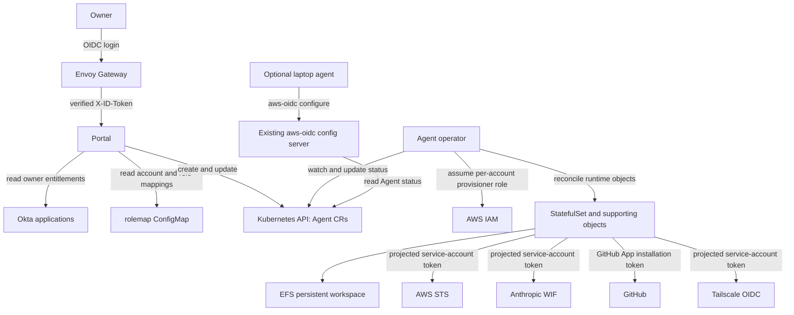

# Persistent Developer Agent Control Plane

## Goal

Build a reusable control plane that gives each person a persistent developer agent with scoped cloud access, Claude identity, GitHub access, private network connectivity and durable storage. The working implementation extends the existing `aws-oidc` Argus app with a portal, an `Agent` custom resource, a Kubernetes operator and a dedicated agent image.

One registered agent maps to one long-running pod and one persistent working directory. A person can open multiple SSH, Claude or Cursor sessions in that pod. Concurrent work uses Git worktrees inside the shared environment instead of creating a pod for every conversation.

The portal is not an access-request system. It lets an owner select only AWS roles they can already assume. The operator mirrors those roles into identities dedicated to that agent. This separates agent activity from the person's normal credentials and gives CloudTrail, GitHub and Tailscale an attributable machine identity.

The `Agent` custom resource is the source of truth. Kubernetes stores desired state and observed status. There is no application database.

## User experience

An owner signs in to a small server-rendered portal and creates an agent by name. Creation starts a guided setup:

1. Configure the runtime's CPU, memory and storage.
2. Enroll the agent in Tailscale and derive its allowed SSH username from the owner's email.
3. Select repositories the fleet GitHub App can reach.
4. Select AWS account and role grants from the owner's existing Okta entitlements.
5. Open the connection page and copy the Tailscale SSH command.

The portal creates a runtime and enables Tailscale by default when those features are available. It starts loading AWS entitlements in the background while the owner completes the earlier setup steps. Owners can later:

- suspend or resume the runtime without deleting its data
- change resource sizing within configured ceilings
- add or remove repositories
- change AWS grants
- select every entitled read-only AWS role in one action
- edit per-agent `CLAUDE.md` and Claude settings
- import selected local Claude project memories
- delete the agent and its provisioned resources

Regular users see only their own agents. Configured administrators can see and manage every agent, and the portal explains why they have that access.

## Architecture


```mermaid
flowchart TB
  owner["Owner"] -->|"OIDC login"| gateway["Envoy Gateway"]
  gateway -->|"verified X-ID-Token"| portal["Portal"]
  portal -->|"read owner entitlements"| okta["Okta applications"]
  portal -->|"read account and role mappings"| rolemap["rolemap ConfigMap"]
  portal -->|"create and update"| api["Kubernetes API: Agent CRs"]

  operator["Agent operator"] -->|"watch and update status"| api
  operator -->|"assume per-account provisioner role"| iam["AWS IAM"]
  operator -->|"reconcile runtime objects"| runtime["StatefulSet and supporting objects"]

  runtime --> efs["EFS persistent workspace"]
  runtime -->|"projected service-account token"| sts["AWS STS"]
  runtime -->|"projected service-account token"| anthropic["Anthropic WIF"]
  runtime -->|"GitHub App installation token"| github["GitHub"]
  runtime -->|"projected service-account token"| tailscale["Tailscale OIDC"]

  config["Existing aws-oidc config server"] -->|"read Agent status"| api
  laptop["Optional laptop agent"] -->|"aws-oidc configure"| config
```

The control plane ships three subcommands from the existing `aws-oidc` image:

- `serve-config` keeps serving human AWS profiles and adds agent profiles to the same response.
- `serve-portal` serves the authenticated HTML portal and writes `Agent` resources.
- `operator` reconciles agent grants and runtimes.

The runtime uses a separate agent image. It contains Claude Code and the tools needed for common infrastructure work.

## Agent custom resource

The custom resource keeps provider access, runtime configuration and user-managed Claude configuration together:

```yaml
apiVersion: agents.czi.team/v1
kind: Agent
metadata:
  name: reviewer
spec:
  displayName: reviewer
  owner: 00u-owner-subject
  ownerEmail: owner@example.org
  grants:
    - aws:
        accountId: "123456789012"
        accountAlias: example-dev
        roleArn: arn:aws:iam::123456789012:role/readonly
        roleName: readonly
        region: us-west-2
  repositories:
    - example/infrastructure
  claude:
    claudeMd: |
      # Agent instructions
    settingsJson: |
      {}
    memoryImports:
      - repository: example/infrastructure
        revision: 0123456789abcdef0123456789abcdef0123456789abcdef0123456789abcdef
  tailscale:
    sshUser: owner
  runtime:
    resources:
      requests:
        cpu: 500m
        memory: 1Gi
      limits:
        cpu: 500m
        memory: 1Gi
    storageSize: 50Gi
    suspended: false
status:
  observedGeneration: 3
  conditions:
    - type: Ready
      status: "True"
    - type: RuntimeReady
      status: "True"
  grants:
    - provider: aws
      aws:
        accountId: "123456789012"
        roleArn: arn:aws:iam::123456789012:role/agents/owner-agent-reviewer-readonly
      state: Provisioned
  persistentVolumeClaimName: agent-reviewer-workspace
  runtime:
    serviceAccountName: remote-agent-0123456789ab
    statefulSetName: agent-reviewer
    readyReplicas: 1
    state: Running
```

Important model choices:

- `spec.grants` is a provider union. AWS is implemented, and another provider can be added without changing the controller's main reconcile loop.
- `spec.runtime` is a curated subset of a pod spec. Owners cannot select a service account, mount arbitrary secrets or request host access.
- An absent runtime keeps the agent as an access identity that can be used from a laptop.
- One runtime belongs to one agent. The earlier thread and workspace hierarchy was removed.
- Status records provisioned grant results and runtime state separately.

## Portal identity and authorization

Envoy Gateway performs the browser login. The portal requires the gateway to forward the OpenID Connect (OIDC) ID token in `X-ID-Token`. It verifies the token signature, issuer and audience before trusting the subject, email or `teamGroups` claim.

The deployment must use an Argus stack chart that forwards the ID token and must configure the portal with a gateway `securityPolicy`. The portal must not accept identity from an unverified user header.

Authorization rules:

- A regular user can list, read, update and delete only agents whose `spec.owner` matches the token subject.
- The portal stamps the owner subject and email during creation.
- A configured Okta group grants administrator access to all agents.
- An administrator edit preserves the original owner.
- Kubernetes role-based access control (RBAC) gives the portal access to Agent resources, the rolemap and memory-import ConfigMaps. It does not receive the operator's cross-account AWS identity.

The current design relies on the portal as the human write gate. A future deployment that gives other principals direct write access to Agent resources should add an admission policy that enforces owner and grant invariants.

## AWS access

### Owner entitlement selection

The portal combines two existing sources:

- Okta application assignments identify the AWS applications assigned to the owner.
- The `rolemap` ConfigMap maps those applications to account and role pairs.

The server validates every submitted grant against a fresh entitlement result. The user cannot type an arbitrary account or role. The portal caches slow Okta lookups per user, serves stale values while it refreshes them and keeps rolemap reads live.

The working implementation grants the agent the selected source role's permissions. This replaced the original curated-policy catalog design.

### Per-agent IAM roles

For every AWS grant, the operator assumes `agent-provisioner` in the target account and reconciles a role under `/agents/`. The role name identifies the owner, agent and source role. The operator:

- creates the role when absent
- mirrors all attached managed policies and inline policies from the selected source role
- repairs its trust policy
- writes the resulting role ARN to Agent status
- removes attached and inline policies before deleting the role
- uses a finalizer so deleting an Agent attempts IAM cleanup first

The controller reconciles grants concurrently with a configured limit. One failed grant does not prevent sibling grants from reconciling. An account where the provisioner role cannot be assumed settles as a failed grant instead of causing a hot retry loop.

The trust policy has two independent web-identity paths:

- The shared agent Okta application's audience plus the owner's Okta subject supports an optional laptop agent.
- The cluster OIDC provider plus the agent's UID-derived service account supports the in-cluster runtime.

The service account name derives from the immutable Agent UID. This prevents overlapping trust patterns between similarly named agents.

### Config server and laptop use

The existing config endpoint adds an optional `agents` field to its response. Older clients ignore it. An upgraded `aws-oidc configure` writes each owned agent's profiles to:

```text
$HOME/.aws-oidc/agents/<agent-name>/config
```

Each file uses the shared agent Okta client and the role ARNs from Agent status. It includes stable account and role profile names plus an `agent-scoped` alias for the first grant. Removing ownership or deleting an agent removes its generated config on the next configure run.

### In-cluster AWS use

The operator writes an AWS ConfigMap for the pod. Every profile points to a provisioned agent role and the projected `sts.amazonaws.com` service-account token. The pod receives:

- `AWS_CONFIG_FILE=/etc/aws/config`
- `AWS_PROFILE=agent-scoped`
- `AWS_REGION`

No static AWS keys enter the pod. The operator updates existing IAM trust policies when a runtime is enabled or disabled.

## Persistent runtime

For each Agent with `spec.runtime`, the operator owns:

- one service account
- one headless service
- one AWS config ConfigMap
- one user Claude config ConfigMap
- one ReadWriteMany persistent volume claim
- one StatefulSet with one replica
- short-lived Jobs for Claude memory imports

The pod mounts its EFS-backed persistent volume at `/workspace` and uses that path as `HOME`. The EFS Container Storage Interface (CSI) driver creates an access point per claim, and the pod and access point use uid and gid 1000.

Suspension scales the StatefulSet to zero and retains the persistent volume claim (PVC). Removing `spec.runtime` prunes runtime objects but retains the PVC. Deleting the Agent releases the owner-referenced PVC. EFS does not enforce the requested size, so the deployment needs storage monitoring outside Kubernetes.

Runtime defaults live in a mounted YAML ConfigMap and refresh without restarting the operator or portal. The precedence is:

1. Agent spec values
2. live ConfigMap defaults
3. process flags and built-in defaults

The portal enforces configured CPU, memory and storage ceilings. It lets administrators override the image and storage class while regular owners use platform defaults.

The runtime security posture includes:

- no default Kubernetes API token
- projected tokens with an explicit audience for each external service
- runtime-default seccomp
- no privilege escalation
- all Linux capabilities dropped when Tailscale is disabled
- owner-controlled environment values cannot overwrite reserved identity variables
- an arm64 node selector matching the current image build

## Claude identity and configuration

When all Anthropic Workload Identity Federation (WIF) settings are configured, the operator projects a second service-account token into the pod. This token has the Anthropic audience and a 10-minute lifetime. The kubelet rotates it before the Anthropic SDK refreshes the exchanged access token.

The pod receives the four `ANTHROPIC_*` variables required by Claude Code. No Anthropic API key is stored in the Agent resource or pod environment.

Claude configuration has two layers:

- Platform-managed settings mount at `/etc/claude-code`. They set the default permission mode, telemetry and mandatory hooks.
- Owner-managed `CLAUDE.md` and `settings.json` mount read-only from a per-agent ConfigMap and appear under `/workspace/.claude`.

The platform default instructions also live in the live defaults ConfigMap. An owner can replace them for one agent in the portal.

The portal can import local Claude project memory Markdown files for a configured repository. It stages validated files in a revision-named ConfigMap and adds the desired revision to the Agent. The operator runs a one-shot Job that atomically replaces that repository's memory directory on the persistent volume, records `Pending`, `Applied` or `Failed` status and deletes completed staging objects.

## GitHub identity and repositories

All agents use a shared GitHub App. The App supplies repository-scoped, revocable credentials and keeps activity attributable to the agent fleet instead of a person's personal access token.

The portal:

- mints installation tokens from the App key
- refreshes an in-memory cache of reachable repositories in the background
- offers type-ahead search from that cache
- rejects repositories no configured installation can reach
- supports a default installation plus an owner-to-installation map for multiple organizations

The operator republishes only the GitHub App private key into a dedicated Secret. It does not expose the Argus workload's complete secret environment to agent pods. It validates the key at startup and mounts it read-only.

The agent image provides:

- `gh`
- a Git credential helper
- a GitHub App token minter
- installation routing based on repository owner

Git and `gh` mint one-hour installation tokens on demand and cache them until five minutes before expiry. The wrapper derives the repository owner from explicit arguments, API paths, `GH_REPO` or the current checkout, then selects the matching installation.

The entrypoint clones configured repositories into `/workspace` on first boot and leaves existing checkouts untouched. Clone failures do not prevent the runtime from starting.

Commits use the owner's email and a name such as `owner's agent (reviewer)`. A managed Claude hook blocks commits on and pushes to `main`, `master` or the remote's default branch. Agents must create a branch and open a pull request.

## Tailscale and SSH

Tailscale enrollment is optional per Agent. When enabled:

1. The operator projects a short-lived service-account token with audience `api.tailscale.com/<client-id>`.
2. The entrypoint extracts the client ID from the audience and calls `tailscale up` with the ID token, configured tag and a stable owner-and-agent hostname.
3. Tailscale validates the cluster issuer, namespace service account subject and allowed tag.
4. The pod enables Tailscale SSH and becomes reachable through the connection command shown in the portal.

The preferred deployment provides a TUN device through the cluster device plugin. The pod receives `NET_ADMIN` and `NET_RAW` only when Tailscale is enabled. The entrypoint falls back to userspace networking if kernel TUN startup fails.

The portal derives `spec.tailscale.sshUser` from the owner's email local part and rejects `root`. A mandatory Claude `PreToolUse` hook blocks `ssh` and `tailscale ssh` commands that omit that user, select a different user or select root.

Tailscale needs:

- an OIDC trust relationship for the cluster issuer and agent service accounts
- ownership of the advertised tag
- network and SSH policy allowing that tag to reach the intended hosts

Codify the trust relationship in Terraform. Do not reproduce the current rdev environment's manual Tailscale console setup.

## Agent image

Build and publish a separate image for agent runtimes. The working image includes:

- Claude Code
- AWS CLI
- Git and GitHub CLI
- Tailscale and OpenSSH client
- Argus, fogg, Terraform, Helm, kubectl and yq
- Go, Node.js and Python
- PostgreSQL and Redis clients
- common shell, network and source-inspection tools

The entrypoint:

- persists selected identity environment variables into SSH login shells
- starts and enrolls Tailscale when configured
- waits briefly for DNS after enrollment
- clones configured repositories
- links owner-managed Claude configuration
- installs the shared CZI Claude plugin bundles once per persistent volume
- starts the configured long-running command

## Deployment and external prerequisites

Deploy the portal and operator beside the existing config server. Keep them as separate services so portal or config-server rollouts do not interrupt reconciliation.

### Kubernetes and Argus

- Install the Agent custom resource definition (CRD).
- Give the portal Agent CRUD plus the minimum rolemap and memory staging access.
- Give the operator Agent status and finalizer access plus namespaced access to StatefulSets, Jobs, services, service accounts, ConfigMaps, PVCs and its dedicated GitHub Secret.
- Configure operator leader election when running more than one replica.
- Expose the portal through an Envoy Gateway OIDC `securityPolicy`.
- Forward `X-ID-Token` to the portal.
- Mount live defaults and managed Claude settings ConfigMaps.
- Install the EFS CSI driver, filesystem, mount targets, security group and `efs-agent-workspaces` StorageClass.
- Provide TUN devices if kernel Tailscale networking is required.

### AWS accounts

Every target account needs:

- the Okta OIDC provider
- the cluster OIDC provider
- an `agent-provisioner` role trusted by the operator's Identity and Access Management Roles for Service Accounts (IRSA) role
- permission for the provisioner to create, read, update and delete roles under `/agents/`
- permission to attach, detach, read, create and delete the managed and inline policies the mirror needs
- `iam:UpdateAssumeRolePolicy`
- a mandatory permissions boundary for agent roles in any production deployment

The operator's IRSA role needs permission to assume each account's provisioner role.

### External identity providers

- Create one shared Okta agent OIDC application for optional laptop use.
- Create an Anthropic WIF rule bound to the cluster issuer, token audience and agent service accounts.
- Create and install the shared GitHub App with only the repository permissions agents need.
- Create the Tailscale federated identity and tag policy.

## Delivery plan

Implement the system in independently usable layers:

1. **Data model and portal shell.** Add the Agent CRD, CR-backed store, server-rendered portal and owner authorization.
2. **AWS grants.** Resolve owner entitlements, add the provider-agnostic controller, reconcile per-agent IAM roles and extend the config server for optional laptop use.
3. **Base runtime.** Add one service account, StatefulSet and EFS workspace per agent, rendered in-cluster AWS profiles and suspend or resume controls.
4. **Claude identity.** Add Anthropic WIF, the agent image, live platform defaults and per-agent Claude configuration.
5. **GitHub workflow.** Add the GitHub App secret projection, multi-installation token routing, repository selection and cloning, owner-attributed commits and branch protection hook.
6. **Private connectivity.** Add Tailscale OIDC enrollment, TUN support, the connection page and SSH-user enforcement.
7. **Guided setup and operations.** Add default runtime and Tailscale creation, background entitlement loading, setup navigation, compact status summaries and memory imports.
8. **Production hardening.** Codify all external identity setup, require the permissions boundary, add complete policy drift removal and add admission enforcement if anything besides the portal can write Agent resources.

Validate each layer before adding the next. The end-to-end acceptance path is:

1. Create an agent as a non-admin owner.
2. Confirm another non-admin cannot see or mutate it.
3. Select an entitled AWS role and confirm the operator creates only the expected agent role.
4. Run `aws sts get-caller-identity` in the pod and confirm the agent role appears.
5. Run Claude without an API key and confirm Anthropic WIF succeeds.
6. Clone a configured repository, create a branch, push it and open a draft pull request.
7. Confirm direct work on the primary branch is blocked.
8. Connect over Tailscale SSH with the derived user and confirm another user and root are blocked.
9. Suspend and resume the agent and confirm `/workspace` survives.
10. Import project memory and confirm the requested revision reaches the persistent Claude memory directory.
11. Delete the agent and confirm Kubernetes runtime objects and reachable IAM roles are removed.

## Known hardening gaps in the working rdev solution

Do not copy these gaps into a production deployment:

- The permissions boundary is configurable but the current rdev deployment leaves it unset because the boundary bootstrap has not landed.
- Policy mirroring adds and updates source policies but does not yet detach a policy that the source role later loses.
- Tailscale's rdev OIDC trust was created manually and must move to Terraform.
- The portal is the only owner and entitlement admission gate. The cluster has no separate admission webhook.
- IAM role names need deterministic truncation or hashing before long owner, agent or source-role names can reach the 64-character limit.
- IAM policy listing and cleanup need pagination for unusually policy-heavy roles.
- An unreachable account is treated as settled during deletion so a finalizer cannot wedge forever. Operators must separately detect any role left behind in an account that later becomes unreachable.
- EFS storage requests are not quotas.
- Rotating the GitHub App private key requires an operator restart because Kubernetes fixes environment variables at pod startup.
