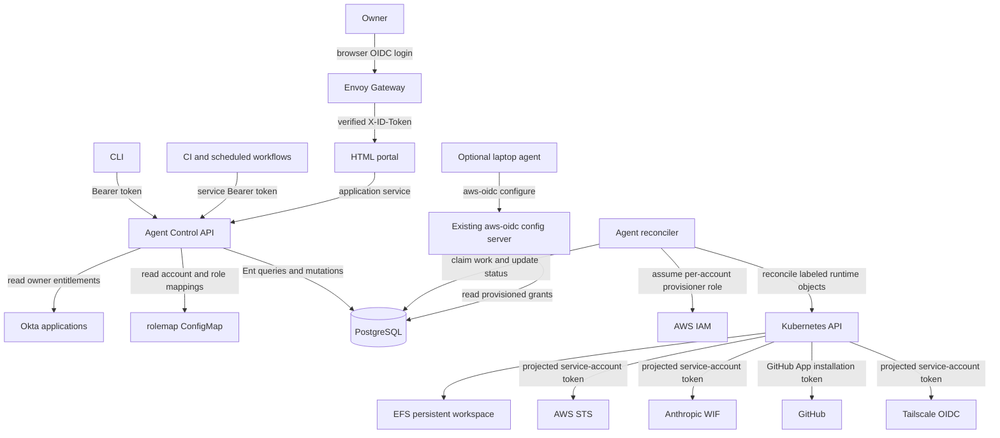

# Persistent Developer Agent Control Plane

## Goal

Build a reusable, API-first control plane that gives each person a persistent developer agent with scoped cloud access, Claude identity, GitHub access, private network connectivity and durable storage. The implementation extends the existing `aws-oidc` Argus app with an Ent-backed versioned JSON API, a portal that consumes the same application service, a reconciliation worker and a dedicated agent image.

One registered agent maps to one long-running pod and one persistent working directory. A person can open multiple SSH, Claude or Cursor sessions in that pod. Concurrent work uses Git worktrees inside the shared environment instead of creating a pod for every conversation.

The API is not an access-request system. It lets an owner select only AWS roles they can already assume. The reconciler mirrors those roles into identities dedicated to that agent. This separates agent activity from the person's normal credentials and gives CloudTrail, GitHub and Tailscale an attributable machine identity.

PostgreSQL is the source of truth. Ent schemas store desired state, observed status, idempotency records and events. Kubernetes holds only runtime resources such as StatefulSets, service accounts, ConfigMaps, Jobs and persistent volume claims.

The API is the public control-plane boundary. CLIs, CI jobs, scheduled workflows and the browser portal all use the same versioned resources, validation and authorization rules. Clients never receive direct database or Kubernetes access.

## User experience

An owner can use either the CLI or a small server-rendered portal to create an agent by name. The portal's guided setup:

1. Configure the runtime's CPU, memory and storage.
2. Enroll the agent in Tailscale and derive its allowed SSH username from the owner's email.
3. Select repositories the fleet GitHub App can reach.
4. Select AWS account and role grants from the owner's existing Okta entitlements.
5. Open the connection page and copy the Tailscale SSH command.

The portal creates a runtime and enables Tailscale by default when those features are available. It starts loading AWS entitlements in the background while the owner completes the earlier setup steps. Owners can later:

- suspend or resume the runtime without deleting its data
- change resource sizing within configured ceilings
- add or remove repositories
- change AWS grants
- select every entitled read-only AWS role in one action
- edit per-agent `CLAUDE.md` and Claude settings
- import selected local Claude project memories
- delete the agent and its provisioned resources

The CLI exposes the same create, inspect, configure, suspend, resume and delete operations for interactive and scripted use. Every mutating command accepts JSON, and every command supports stable JSON output. YAML input may remain a CLI convenience. Regular users see only their own agents. Configured administrators can see and manage every agent, and the portal explains why they have that access.

## Architecture


```mermaid
flowchart TB
  owner["Owner"] -->|"browser OIDC login"| gateway["Envoy Gateway"]
  gateway -->|"verified X-ID-Token"| portal["HTML portal"]
  cli["CLI"] -->|"Bearer token"| controlAPI["Agent Control API"]
  workflow["CI and scheduled workflows"] -->|"service Bearer token"| controlAPI
  portal -->|"application service"| controlAPI
  controlAPI -->|"read owner entitlements"| okta["Okta applications"]
  controlAPI -->|"read account and role mappings"| rolemap["rolemap ConfigMap"]
  controlAPI -->|"Ent queries and mutations"| database[("PostgreSQL")]

  operator["Agent reconciler"] -->|"claim work and update status"| database
  operator -->|"assume per-account provisioner role"| iam["AWS IAM"]
  operator -->|"reconcile labeled runtime objects"| runtime["Kubernetes API"]

  runtime --> efs["EFS persistent workspace"]
  runtime -->|"projected service-account token"| sts["AWS STS"]
  runtime -->|"projected service-account token"| anthropic["Anthropic WIF"]
  runtime -->|"GitHub App installation token"| github["GitHub"]
  runtime -->|"projected service-account token"| tailscale["Tailscale OIDC"]

  config["Existing aws-oidc config server"] -->|"read provisioned grants"| database
  laptop["Optional laptop agent"] -->|"aws-oidc configure"| config
```

The control plane ships three subcommands from the existing `aws-oidc` image:

- `serve-config` keeps serving human AWS profiles and adds agent profiles to the same response.
- `serve-agents` exposes the authenticated `/api/v1` JSON API and the optional HTML portal.
- `reconcile-agents` reconciles Ent agent records into AWS access and Kubernetes runtimes.

The runtime uses a separate agent image. It contains Claude Code and the tools needed for common infrastructure work.

## Ent data model and generated API

Follow the Argus API pattern:

- Define the control-plane model under `internal/ent/schema`.
- Generate Ent entities, queries, mutations, privacy hooks and migrations with `entc`.
- Add the Entoas extension with an exclude-by-default policy. Explicitly annotate only the operations and edges that belong in the public API.
- Add Ogent to generate the OpenAPI server, router, request and response types and client from the same schema graph.
- Generate `openapi.json` as a checked-in artifact.
- Generate the Go CLI client from `openapi.json` with `oapi-codegen`. Generate other clients only when a real caller needs them.
- Put hand-written lifecycle actions and aggregate read models into the same OpenAPI generation step, matching Argus's custom endpoint pattern.

Use the [Argus Ent generator](https://github.com/chanzuckerberg/argus/blob/main/core/api/internal/ent/entc/entc.go), [generation entrypoint](https://github.com/chanzuckerberg/argus/blob/main/core/api/internal/ent/generate.go) and [Ogent server assembly](https://github.com/chanzuckerberg/argus/blob/main/core/api/internal/app/server_v1.go) as the structural references.

Use these Ent entities:

- `Agent` stores immutable UUID, unique owner-scoped name, display name, owner subject, owner email, desired generation, observed generation, lifecycle state and soft-deletion state.
- `AWSGrant` stores account, account alias, source role ARN, source role name, region, provisioned role ARN, provisioning state and last error. It has a required edge to one Agent.
- `Repository` stores a normalized `owner/repo` value and has a required edge to one Agent.
- `Runtime` stores enabled, suspended, image, command, arguments, environment, CPU, memory, storage class, storage size, Kubernetes object names, runtime state and last error. It has a unique edge to one Agent.
- `TailscaleAccess` stores enabled and the derived SSH user. It has a unique edge to one Agent.
- `ClaudeConfig` stores owner-managed `CLAUDE.md` and settings JSON. It has a unique edge to one Agent.
- `MemoryImport` stores repository, content revision, state, error and timestamps. It has a required edge to one Agent.
- `MemoryImportFile` stores one validated Markdown filename and bounded content. It has a required edge to one MemoryImport. The reconciler materializes these rows as a short-lived ConfigMap for the import Job.
- `IdempotencyRecord` stores principal, operation, key hash, request hash, response reference and expiry.
- `Event` stores event type, actor when applicable, Agent, owner, request ID, outcome and structured non-secret detail. API mutations and reconciliation both emit events.
- `ReconcileRequest` is a durable outbox row keyed by agent and desired generation. It records availability, attempts and lease state for the worker.

Keep provider-specific grants as separate Ent entities instead of a JSON union. Adding another provider means adding its schema and a provider implementation while preserving the common Agent edge and reconciliation interface.

Store flexible owner-provided environment values as validated JSON only where relational columns do not fit. Keep identity, authorization, lifecycle, status and lookup fields as typed indexed columns.

Use Ent mixins for UUIDs and immutable create time plus mutable update time. Add a monotonic version field for optimistic concurrency. Add unique indexes for owner plus agent name, agent plus AWS account and source role and agent plus repository.

Ent privacy policies are the final authorization boundary:

- Human query and mutation policies filter Agents by owner subject unless the principal is an administrator.
- Service principals filter by allowed owner or Agent IDs and token scopes.
- Edges inherit the parent Agent decision so a caller cannot reach another owner's grant, repository or memory import through a nested endpoint.
- Internal reconciliation uses an explicit system decision context. HTTP requests can never select it.

Hooks enforce invariants and enqueue reconciliation in the same database transaction:

- Stamp human ownership and reject caller-supplied owner fields.
- Derive and validate the Tailscale SSH user.
- Validate runtime ceilings and reserved environment names.
- Validate AWS grants against freshly resolved owner entitlements.
- Validate repositories against the GitHub App's reachable set.
- Increment desired generation after a material change.
- Insert one `ReconcileRequest` outbox row for the new generation.
- Insert an audit `Event` in the mutation transaction so it persists only when the mutation commits.

PostgreSQL is authoritative. Use SQLite-backed Ent tests for schema, policy, hook and handler coverage. Run schema migrations with Atlas through Ent, guarded by a PostgreSQL advisory lock so multiple API replicas cannot race migration data definition language (DDL).

## Agent Control API

The Ent and Entoas API owns all control-plane reads and writes. Keep Kubernetes, Okta, GitHub and provider details behind it. Publish the generated OpenAPI 3 specification and generate the CLI client from that contract so automation does not depend on HTML forms or internal Go types.

Use `/api/v1` from the first release. Additive fields remain backward compatible within v1. Breaking request or response changes require a new major path. Every response uses JSON, including errors.

Use Entoas annotations to mark internal fields and edges read-only or excluded. Use custom OpenAPI schemas for lifecycle actions and aggregate responses that do not map cleanly to one Ent entity. Do not expose outbox leases, raw audit detail, token material or internal reconciliation fields.

Core resources:

- `GET /api/v1/agents` lists agents visible to the caller, with pagination and stable filters for owner, readiness and runtime state.
- `POST /api/v1/agents` creates an Agent. Human callers become the owner. Only explicitly authorized automation may supply an owner.
- `GET /api/v1/agents/{name}` returns desired configuration, observed status and connection information.
- `PATCH /api/v1/agents/{name}` applies a merge patch to owner-editable fields. Reject Kubernetes metadata and status fields.
- `DELETE /api/v1/agents/{name}` starts durable asynchronous cleanup and returns the deleting resource.
- `POST /api/v1/agents/{name}:suspend` and `POST /api/v1/agents/{name}:resume` provide idempotent lifecycle actions.
- `GET /api/v1/entitlements/aws` returns the caller's grantable AWS accounts and roles.
- `GET /api/v1/repositories` searches repositories reachable through configured GitHub App installations.
- `POST /api/v1/agents/{name}/memory-imports` stages a revisioned project-memory import.
- `GET /api/v1/agents/{name}/events` returns recent provisioning and runtime events without exposing unrestricted Kubernetes event access.

Create and patch requests return the accepted Agent representation immediately. Reconciliation remains asynchronous. Clients watch `status.conditions`, poll with exponential backoff or request a bounded server-side wait such as `?wait=Ready&timeout=60s`. A timeout never cancels reconciliation.

API behavior for reliable workflows:

- Accept an `Idempotency-Key` on creates and memory imports. Replaying the same key and body returns the original result. Reusing a key with a different body returns `409 Conflict`. Persist the key and request hashes in `IdempotencyRecord` within the mutation transaction.
- Return an opaque `ETag` derived from the Ent version field. Mutations accept `If-Match` and use a version predicate in the update. Return `412 Precondition Failed` when another mutation wins.
- Use stable machine-readable error codes, a human message, field-level validation details and a request ID.
- Return `202 Accepted` only for operations whose result is not yet represented by the returned resource. Otherwise return the created or updated representation.
- Support `application/json` for normal requests and `multipart/form-data` only for bounded memory-import files.
- Enforce request size, file count, file size, rate and timeout limits at the service boundary.
- Emit an audit event for every mutation with principal, action, agent, owner, request ID and outcome. Never log bearer tokens, projected tokens, private keys or imported memory contents.

The first CLI can be a new `aws-oidc agents` command group:

```text
aws-oidc agents list --output json
aws-oidc agents create --file agent.yaml
aws-oidc agents get reviewer --output json
aws-oidc agents apply reviewer --file desired.json --if-match <etag>
aws-oidc agents suspend reviewer
aws-oidc agents resume reviewer
aws-oidc agents wait reviewer --for RuntimeReady --timeout 5m
aws-oidc agents delete reviewer
```

Commands return nonzero on authentication, authorization, validation, conflict or terminal reconciliation failure. Human-readable output is the default for terminals. `--output json` is stable for workflows.

The portal remains server-rendered and small. Its pages and forms consume the same `/api/v1` contract rather than maintaining separate validation or mutation handlers. Browser-specific handlers may render HTML and translate form submissions, but they call the same generated client or application commands as external clients.

## Authentication and authorization

Envoy Gateway performs the browser login. The portal requires the gateway to forward the OpenID Connect (OIDC) ID token in `X-ID-Token`. It verifies the token signature, issuer and audience before trusting the subject, email or `teamGroups` claim.

CLI users authenticate through an Okta native OIDC client with device authorization and send `Authorization: Bearer <token>` to the API. The CLI stores refresh material in the operating system credential store and refreshes short-lived access tokens. It never writes tokens into its config file or command arguments.

Noninteractive workflows use a distinct Okta service application and client-credentials tokens. Give each service principal explicit API scopes and an allowlist of owners or agents it can manage. Do not let a service token impersonate an arbitrary human or inherit an administrator's group access.

The service accepts two trusted presentation paths and normalizes both into one internal principal:

- a verified `X-ID-Token` from the gateway for browser requests
- a verified bearer token for CLIs and automation

Reject requests that present both identities unless they resolve to the same issuer and subject. Verify signature, issuer, audience, expiry and required scopes inside the service. The API route must not depend on an interactive gateway redirect. Expose it on a separate API hostname or a gateway route that passes bearer requests through unchanged.

The deployment must use an Argus stack chart that forwards the ID token and must configure the portal with a gateway `securityPolicy`. The service must not accept identity from an unverified user header.

Protect browser mutations with same-site cookies and Cross-Site Request Forgery (CSRF) tokens. Bearer-only API requests do not use cookie authentication and reject browser session cookies on the API hostname.

Authorization rules:

- A regular user can list, read, update and delete only Agents whose `owner_subject` matches the token subject.
- The API stamps the owner subject and email during human creation.
- A configured Okta group grants administrator access to all agents.
- An administrator edit preserves the original owner.
- A service principal can perform only actions granted by token scopes and server-side principal policy.
- Read scopes and write scopes are separate. Memory import, deletion and administration require dedicated scopes.
- Kubernetes role-based access control (RBAC) gives the API service read access to the rolemap ConfigMap only. It does not receive the reconciler's cross-account AWS identity or workload mutation access.

The API is the only supported write gate. No human, CLI or workflow receives Kubernetes credentials. Add an admission policy as defense in depth if any other principal can write Agent resources.

## Reconciliation model

The reconciler is a separate process that consumes the transactional outbox. It does not serve HTTP and the API does not perform AWS or Kubernetes writes inside request transactions.

For each `ReconcileRequest`, a worker:

1. Claims the row with a lease so multiple replicas can run safely.
2. Loads a consistent Ent snapshot of the Agent and its edges.
3. Reconciles provider grants with bounded parallelism.
4. Reconciles Kubernetes runtime objects labeled with the immutable Agent UUID and desired generation.
5. Writes provider status, runtime status, observed generation and any public error in one Ent transaction.
6. Completes the outbox row or records a retry with exponential backoff.

Kubernetes informers watch the labeled StatefulSets and Jobs and enqueue the corresponding Agent UUID when readiness or memory-import status changes. A periodic Ent scan re-enqueues stale generations and active runtimes so a lost event or expired lease cannot strand an Agent.

Deletion is a durable lifecycle state, not a hard database delete at request time. The API marks the Agent deleting and enqueues it. The reconciler removes reachable IAM roles and Kubernetes runtime objects, preserves the audit history, marks cleanup complete and only then soft-deletes the Agent from normal queries. Operators can retry or explicitly waive cleanup for an account that remains unreachable.

This model keeps one source of truth. Do not mirror desired state into an Agent custom resource or create a second controller-owned database.

## AWS access

### Owner entitlement selection

The API combines two existing sources:

- Okta application assignments identify the AWS applications assigned to the owner.
- The `rolemap` ConfigMap maps those applications to account and role pairs.

The server validates every submitted grant against a fresh entitlement result. The user cannot submit an arbitrary account or role. The API caches slow Okta lookups per user, serves stale values while it refreshes them and keeps rolemap reads live.

The working implementation grants the agent the selected source role's permissions. This replaced the original curated-policy catalog design.

### Per-agent IAM roles

For every AWS grant, the reconciler assumes `agent-provisioner` in the target account and reconciles a role under `/agents/`. The role name identifies the owner, agent and source role. The reconciler:

- creates the role when absent
- mirrors all attached managed policies and inline policies from the selected source role
- repairs its trust policy
- writes the resulting role ARN and state to the `AWSGrant` row
- removes attached and inline policies before deleting the role
- completes IAM cleanup before the Agent deletion workflow can finish

The worker reconciles grants concurrently with a configured limit. One failed grant does not prevent sibling grants from reconciling. An account where the provisioner role cannot be assumed records a failed grant without causing a hot retry loop.

The trust policy has two independent web-identity paths:

- The shared agent Okta application's audience plus the owner's Okta subject supports an optional laptop agent.
- The cluster OIDC provider plus the agent's UID-derived service account supports the in-cluster runtime.

The service account name derives from the immutable Ent Agent UUID. This prevents overlapping trust patterns between similarly named agents.

### Config server and laptop use

The existing config endpoint adds an optional `agents` field to its response. Older clients ignore it. An upgraded `aws-oidc configure` writes each owned agent's profiles to:

```text
$HOME/.aws-oidc/agents/<agent-name>/config
```

Each file uses the shared agent Okta client and the provisioned role ARNs from Ent. It includes stable account and role profile names plus an `agent-scoped` alias for the first grant. Removing ownership or deleting an agent removes its generated config on the next configure run.

### In-cluster AWS use

The reconciler writes an AWS ConfigMap for the pod. Every profile points to a provisioned agent role and the projected `sts.amazonaws.com` service-account token. The pod receives:

- `AWS_CONFIG_FILE=/etc/aws/config`
- `AWS_PROFILE=agent-scoped`
- `AWS_REGION`

No static AWS keys enter the pod. The reconciler updates existing IAM trust policies when a runtime is enabled or disabled.

## Persistent runtime

For each Agent with an enabled Runtime edge, the reconciler manages:

- one service account
- one headless service
- one AWS config ConfigMap
- one user Claude config ConfigMap
- one ReadWriteMany persistent volume claim
- one StatefulSet with one replica
- short-lived Jobs for Claude memory imports

The pod mounts its EFS-backed persistent volume at `/workspace` and uses that path as `HOME`. The EFS Container Storage Interface (CSI) driver creates an access point per claim, and the pod and access point use uid and gid 1000.

Every object carries the Agent UUID and managed-by labels. Suspension scales the StatefulSet to zero and retains the persistent volume claim (PVC). Disabling the Runtime prunes compute and identity objects but retains the PVC. Deleting the Agent explicitly releases the PVC after provider cleanup. EFS does not enforce the requested size, so the deployment needs storage monitoring outside Kubernetes.

Runtime defaults live in a mounted YAML ConfigMap and refresh without restarting the reconciler or API service. The precedence is:

1. Agent spec values
2. live ConfigMap defaults
3. process flags and built-in defaults

The API enforces configured CPU, memory and storage ceilings. It lets administrators override the image and storage class while regular owners use platform defaults.

The runtime security posture includes:

- no default Kubernetes API token
- projected tokens with an explicit audience for each external service
- runtime-default seccomp
- no privilege escalation
- all Linux capabilities dropped when Tailscale is disabled
- owner-controlled environment values cannot overwrite reserved identity variables
- an arm64 node selector matching the current image build

## Claude identity and configuration

When all Anthropic Workload Identity Federation (WIF) settings are configured, the reconciler projects a second service-account token into the pod. This token has the Anthropic audience and a 10-minute lifetime. The kubelet rotates it before the Anthropic SDK refreshes the exchanged access token.

The pod receives the four `ANTHROPIC_*` variables required by Claude Code. No Anthropic API key is stored in the Agent resource or pod environment.

Claude configuration has two layers:

- Platform-managed settings mount at `/etc/claude-code`. They set the default permission mode, telemetry and mandatory hooks.
- Owner-managed `CLAUDE.md` and `settings.json` mount read-only from a per-agent ConfigMap and appear under `/workspace/.claude`.

The platform default instructions also live in the live defaults ConfigMap. An owner can replace them for one agent through the API or portal.

The API can import local Claude project memory Markdown files for a configured repository. It stores validated files and the desired revision through Ent. The reconciler materializes a revision-named ConfigMap and runs a one-shot Job that atomically replaces that repository's memory directory on the persistent volume, records `Pending`, `Applied` or `Failed` status in Ent and deletes completed Kubernetes staging objects.

## GitHub identity and repositories

All agents use a shared GitHub App. The App supplies repository-scoped, revocable credentials and keeps activity attributable to the agent fleet instead of a person's personal access token.

The API:

- mints installation tokens from the App key
- refreshes an in-memory cache of reachable repositories in the background
- offers type-ahead search from that cache
- rejects repositories no configured installation can reach
- supports a default installation plus an owner-to-installation map for multiple organizations

The reconciler republishes only the GitHub App private key into a dedicated Secret. It does not expose the Argus workload's complete secret environment to agent pods. It validates the key at startup and mounts it read-only.

The agent image provides:

- `gh`
- a Git credential helper
- a GitHub App token minter
- installation routing based on repository owner

Git and `gh` mint one-hour installation tokens on demand and cache them until five minutes before expiry. The wrapper derives the repository owner from explicit arguments, API paths, `GH_REPO` or the current checkout, then selects the matching installation.

The entrypoint clones configured repositories into `/workspace` on first boot and leaves existing checkouts untouched. Clone failures do not prevent the runtime from starting.

Commits use the owner's email and a name such as `owner's agent (reviewer)`. A managed Claude hook blocks commits on and pushes to `main`, `master` or the remote's default branch. Agents must create a branch and open a pull request.

## Tailscale and SSH

Tailscale enrollment is optional per Agent. When enabled:

1. The reconciler projects a short-lived service-account token with audience `api.tailscale.com/<client-id>`.
2. The entrypoint extracts the client ID from the audience and calls `tailscale up` with the ID token, configured tag and a stable owner-and-agent hostname.
3. Tailscale validates the cluster issuer, namespace service account subject and allowed tag.
4. The pod enables Tailscale SSH and becomes reachable through the connection command shown in the portal.

The preferred deployment provides a TUN device through the cluster device plugin. The pod receives `NET_ADMIN` and `NET_RAW` only when Tailscale is enabled. The entrypoint falls back to userspace networking if kernel TUN startup fails.

The API derives `TailscaleAccess.ssh_user` from the owner's email local part and rejects `root`. A mandatory Claude `PreToolUse` hook blocks `ssh` and `tailscale ssh` commands that omit that user, select a different user or select root.

Tailscale needs:

- an OIDC trust relationship for the cluster issuer and agent service accounts
- ownership of the advertised tag
- network and SSH policy allowing that tag to reach the intended hosts

Codify the trust relationship in Terraform. Do not reproduce the current rdev environment's manual Tailscale console setup.

## Agent image

Build and publish a separate image for agent runtimes. The working image includes:

- Claude Code
- AWS CLI
- Git and GitHub CLI
- Tailscale and OpenSSH client
- Argus, fogg, Terraform, Helm, kubectl and yq
- Go, Node.js and Python
- PostgreSQL and Redis clients
- common shell, network and source-inspection tools

The entrypoint:

- persists selected identity environment variables into SSH login shells
- starts and enrolls Tailscale when configured
- waits briefly for DNS after enrollment
- clones configured repositories
- links owner-managed Claude configuration
- installs the shared CZI Claude plugin bundles once per persistent volume
- starts the configured long-running command

## Deployment and external prerequisites

Deploy the API service and reconciler beside the existing config server. The API service also serves the optional portal. Keep it separate from the reconciler so API or config-server rollouts do not interrupt reconciliation.

Provision PostgreSQL with encrypted connections, backups, point-in-time recovery and separate least-privilege credentials for migrations, the API and the reconciler. The config server gets read-only access to provisioned grants. Run Ent and Atlas migrations as a controlled deployment step with the same PostgreSQL advisory-lock pattern Argus uses.

### Kubernetes and Argus

- Give the API service read access to the rolemap ConfigMap. It does not need workload write access.
- Give the reconciler namespaced access to StatefulSets, Jobs, services, service accounts, ConfigMaps, persistent volume claims and its dedicated GitHub Secret.
- Run multiple reconcilers with database-backed leases and bounded work concurrency. No Kubernetes leader election is required.
- Expose browser routes through an Envoy Gateway OIDC `securityPolicy`.
- Expose `/api/v1` on a non-redirecting bearer-token route or separate API hostname.
- Forward `X-ID-Token` only on the browser-authenticated route.
- Mount live defaults and managed Claude settings ConfigMaps.
- Install the EFS CSI driver, filesystem, mount targets, security group and `efs-agent-workspaces` StorageClass.
- Provide TUN devices if kernel Tailscale networking is required.

### AWS accounts

Every target account needs:

- the Okta OIDC provider
- the cluster OIDC provider
- an `agent-provisioner` role trusted by the reconciler's Identity and Access Management Roles for Service Accounts (IRSA) role
- permission for the provisioner to create, read, update and delete roles under `/agents/`
- permission to attach, detach, read, create and delete the managed and inline policies the mirror needs
- `iam:UpdateAssumeRolePolicy`
- a mandatory permissions boundary for agent roles in any production deployment

The reconciler's IRSA role needs permission to assume each account's provisioner role.

### External identity providers

- Create an Okta native OIDC application with device authorization for the human CLI.
- Create an Okta service application, API authorization server scopes and principal policy for approved automation.
- Create one shared Okta agent OIDC application for optional laptop use.
- Create an Anthropic WIF rule bound to the cluster issuer, token audience and agent service accounts.
- Create and install the shared GitHub App with only the repository permissions agents need.
- Create the Tailscale federated identity and tag policy.

## Migration from the working CR-backed solution

A greenfield deployment starts directly on Ent. Migrating the current rdev solution requires a short controlled cutover:

1. Deploy PostgreSQL, run Ent migrations and deploy the API in read-only comparison mode.
2. Import each Agent custom resource, its status and its related memory staging data into one Ent transaction. Use the existing Kubernetes Agent UID as the Ent UUID when valid so service account names, IAM trust subjects and labeled runtime objects remain stable.
3. Compare API representations and entitlement decisions against the existing portal for every imported Agent.
4. Pause browser mutations, run a final incremental import and record the Kubernetes resource version used for each row.
5. Start the Ent outbox reconciler, switch the portal and CLI to the generated API and disable the CR-backed operator.
6. Verify every Ent desired generation reaches its observed generation before allowing writes again.
7. Remove Agent custom resources and the CRD only after the reconciler has adopted every labeled runtime object and a rollback window has passed.

Do not run independent Ent and custom-resource writers. During rollback, stop the Ent writer and reconciler before re-enabling the old portal and operator.

## Delivery plan

Implement the system in independently usable layers:

1. **Ent foundation.** Add PostgreSQL, Ent schemas, privacy policies, hooks, transactional outbox, Ent and Atlas migrations and SQLite schema tests.
2. **Entoas API and authentication.** Configure Entoas with exclude-by-default exposure, generate Ogent server and OpenAPI artifacts, add custom lifecycle operations, expose `/api/v1`, verify browser and bearer identities and add structured errors, idempotency, optimistic concurrency and audit events.
3. **CLI and portal.** Generate the API client, add `aws-oidc agents` commands and rebuild the server-rendered portal as another client of the same contract.
4. **AWS grants.** Resolve owner entitlements, add the provider-agnostic Ent outbox worker, reconcile per-agent IAM roles and extend the config server for optional laptop use.
5. **Base runtime.** Add one service account, StatefulSet and EFS workspace per agent, rendered in-cluster AWS profiles and suspend or resume controls.
6. **Claude identity.** Add Anthropic WIF, the agent image, live platform defaults and per-agent Claude configuration.
7. **GitHub workflow.** Add the GitHub App secret projection, multi-installation token routing, repository selection and cloning, owner-attributed commits and branch protection hook.
8. **Private connectivity.** Add Tailscale OIDC enrollment, TUN support, the connection page and SSH-user enforcement.
9. **Guided setup and operations.** Add default runtime and Tailscale creation, background entitlement loading, setup navigation, compact status summaries and memory imports.
10. **Production hardening.** Codify all external identity setup, require the permissions boundary, add complete policy drift removal and verify database backup and restore.

Validate each layer before adding the next. The end-to-end acceptance path is:

1. Create the same agent through the CLI and portal and confirm both return the same API representation.
2. Replay a create with the same idempotency key and confirm it does not create another Agent.
3. Attempt a stale conditional update and confirm the API returns `412 Precondition Failed`.
4. Confirm another non-admin cannot see or mutate the agent.
5. Confirm an automation principal can perform only its configured scopes against its configured owners or agents.
6. Select an entitled AWS role and confirm the reconciler creates only the expected agent role.
7. Run `aws sts get-caller-identity` in the pod and confirm the agent role appears.
8. Run Claude without an API key and confirm Anthropic WIF succeeds.
9. Clone a configured repository, create a branch, push it and open a draft pull request.
10. Confirm direct work on the primary branch is blocked.
11. Connect over Tailscale SSH with the derived user and confirm another user and root are blocked.
12. Suspend and resume the agent through the API and confirm `/workspace` survives.
13. Import project memory and confirm the requested revision reaches the persistent Claude memory directory.
14. Delete the agent and confirm Kubernetes runtime objects and reachable IAM roles are removed.

## Known hardening gaps in the working rdev solution

Do not copy these gaps into a production deployment:

- The permissions boundary is configurable but the current rdev deployment leaves it unset because the boundary bootstrap has not landed.
- Policy mirroring adds and updates source policies but does not yet detach a policy that the source role later loses.
- Tailscale's rdev OIDC trust was created manually and must move to Terraform.
- The current browser handlers and Agent custom resources must move to the Ent-backed API. A one-time migration must preserve owners, desired configuration, provisioned role ARNs and runtime state before the old writer is disabled.
- IAM role names need deterministic truncation or hashing before long owner, agent or source-role names can reach the 64-character limit.
- IAM policy listing and cleanup need pagination for unusually policy-heavy roles.
- The deletion workflow needs an explicit operator waiver for an account that remains unreachable. It must never silently report complete while an IAM role may remain.
- EFS storage requests are not quotas.
- Rotating the GitHub App private key requires a reconciler restart because Kubernetes fixes environment variables at pod startup.
