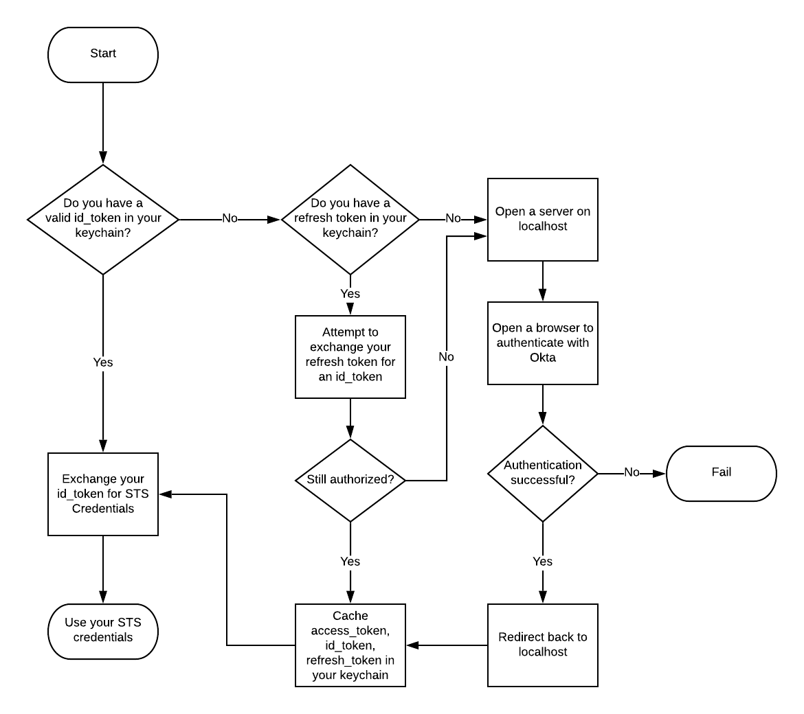

# AWS-OIDC flow
This is the general flow for an `aws-oidc` command such as (`exec` and `creds-process`). In this diagram, we intentionally "hide" several steps in the oauth flow to more effectively convey the message.

